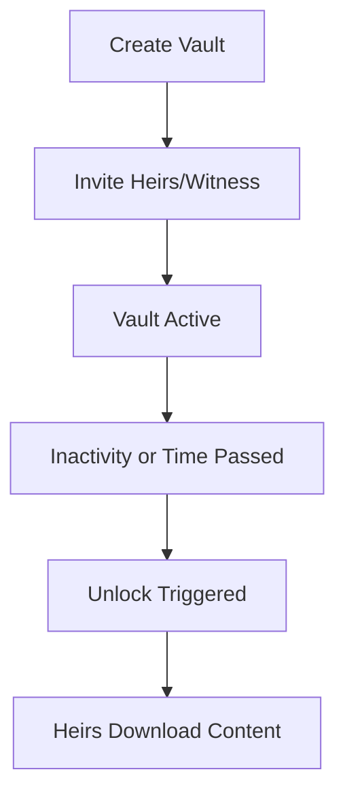

# 👋 Welcome to LiVault

**LiVault** helps you secure your most precious digital data — passwords, letters, and important files — and pass them on to the right people when the time comes.

---

## 🧭 What is LiVault?

LiVault is a **decentralized digital legacy vault** built on blockchain. You can:
- Store encrypted documents and private notes
- Set rules like “unlock after 1 year” or “needs 2 heirs’ approval”
- Invite trusted **heirs** and **witnesses**
- Pay once, keep forever (no subscription!)

---

## 👥 Who's Involved?

| Role | What They Can Do |
|------|------------------|
| **You (Vault Owner)** | Create vault, set rules, upload content |
| **Heirs** | Get invited, approve unlock, access content after unlock |
| **Witnesses** | Optional. Can trigger unlock if owner is inactive |
| **Admin (System)** | Only sees usage stats — never your data |

---

## 🔐 How It Works

1. **Create Your Vault**
   - Choose storage plan
   - Set unlock rules (e.g., 2 heirs, 1 witness)
   - Pay once using ICP or crypto via ChainFusion

2. **Upload Your Content**
   - Files (PDF, JPG, DOCX, etc.)
   - Passwords or secrets
   - Personal letters to loved ones

3. **Invite Heirs and Witnesses**
   - One-time invite link or QR code
   - They log in, set a passphrase, and receive a secure key

4. **Unlock When the Time Comes**
   - Unlock conditions met (e.g. owner inactive + heirs approved)
   - Heirs download your encrypted legacy

---

## 📋 Content Types You Can Store

- ✉️ Personal Letters
- 🔐 Passwords or Secrets
- 📄 Documents (Wills, IDs, etc.)
- 🖼 Photos or Images

> All encrypted in your browser. We never see your data.

---

## 💸 Pricing Plan

One-time payment only. No recurring subscription. Vaults remain valid up to 10 years.

| Plan      | Storage | Heirs | Witness | Base Price (ICP)* |
|-----------|---------|-------|---------|-------------------|
| Basic     | 5 MB    | up to 2 | optional (1) | 3.0       |
| Standard  | 10 MB   | up to 3 | optional (1) | 6.0        |
| Premium   | 50 MB   | up to 5 | optional (1) | 27.0        |
| Deluxe    | 100 MB  | up to 8 | optional (1) | 55.0        |
| Titan†    | 250 MB  | up to 10 | optional (1) | 140.0         |

> *Base Price may increase by 0–25% depending on your age bracket.
> †Titan plan is available for institutional or extended-family use cases.

*Payment accepted in ICP token or any crypto via ChainFusion Swap.*

---

## 📅 Vault Lifecycle

---

## 💡 Tips
- 📷 Print your QR keys – safe fallback
- ⏱ Set clear unlock conditions – time + approvals
- 🔄 You can update vault anytime during active period
- 🔐 Use strong passphrase when claiming your invite

## 🧑‍💻 Need Help?
Visit Help & Support from your dashboard
Contact us: support@livault.app

---

> All your secrets — preserved for the right moment.

> © 2025 LiVault. Built on Internet Computer (ICP).