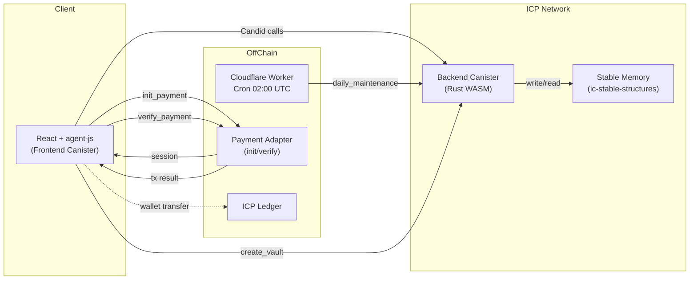
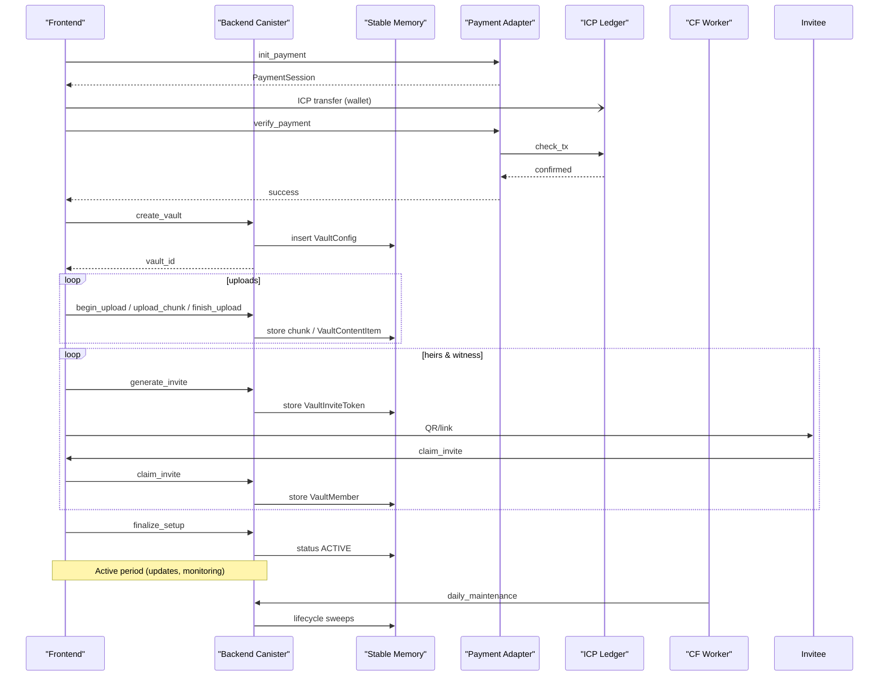
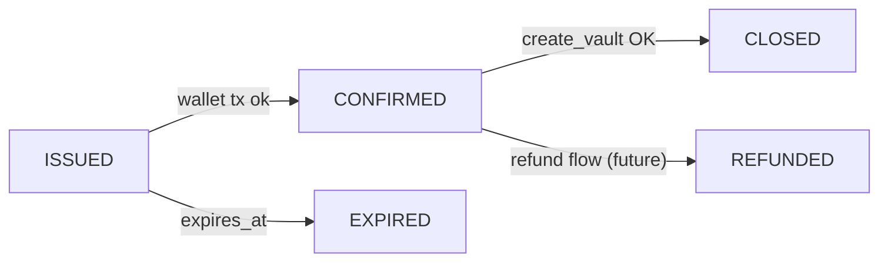
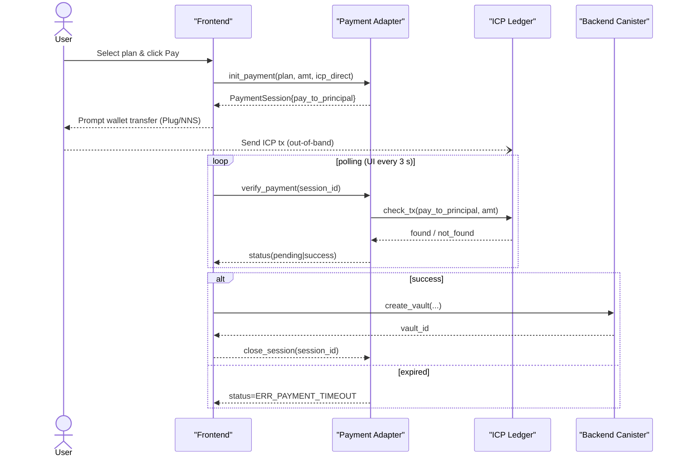
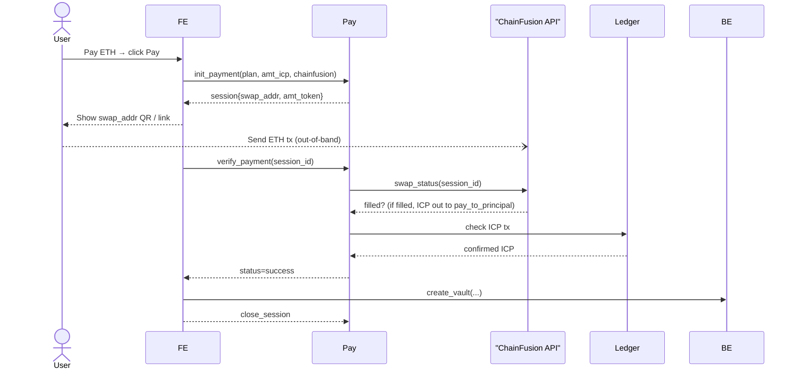

# LiVault – Backend Architecture Documentation v1.0

> **Change‑log 2025‑04‑18**  
> - This are example of changelog should be written
> - Follow this rules for any change after version v1.0  

> **Scope:** Internet Computer (ICP) backend canister powering LiVault business logic, state‑persistence, cryptography, and off‑chain integrations.


## Links to Schemas

- **VaultConfig** schema: [`vault_config.schema.json`](vault_config.schema.json)
- **VaultContentItem** schema: [`vault_content_item.schema.json`](vault_content_item.schema.json)
- **VaultInviteToken** schema: [`vault_invite_token.schema.json`](vault_invite_token.schema.json)
- **VaultMember** schema: [`vault_member.schema.json`](vault_member.schema.json)

---

## 1. Goals & Non‑Goals
| Objective | In Scope | Out of Scope |
|-----------|----------|--------------|
| Deterministic vault lifecycle logic (create → active → unlock → purge) | ✔ | Front‑end components |
| End‑to‑end encryption & Shamir key‑share issuance | ✔ | Off‑chain key recovery services |
| Single‑canister MVP with predictable costs (≤ 4 GB stable memory) | ✔ | Multi‑canister horizontal sharding |
| Low latency (P99 < 250 ms @ 5 RPS) | ✔ | > 50 RPS scaling tier |
| Ledger‑verified one‑time payments & upgrades | ✔ | Recurring subscriptions |

---

## 2. High‑Level Component Diagram


---

## 2.1 Project Structure (Backend Canister - Rust)
The backend canister code, located in `src/backend/`, follows a modular structure:

```
src/backend/
├── Cargo.toml          # Project dependencies and metadata
├── lib.rs              # Canister entry point (init, post_upgrade, heartbeat)
├── api.rs              # Defines public Candid endpoints (query/update functions)
├── error.rs            # Custom error types for the canister (VaultError enum)
├── metrics.rs          # Logic for collecting and exposing canister metrics
├── models/             # Data structures & domain models (Vault, Member, etc.)
│   ├── common.rs       # Shared types (IDs, Timestamps, Roles, Status enums)
│   ├── vault_config.rs # VaultConfig struct and related types
│   ├── vault_member.rs # VaultMember struct and related types
│   ├── vault_invite_token.rs # VaultInviteToken struct
│   └── vault_content_item.rs # VaultContentItem struct
│   └── payment.rs      # PaymentSession struct and PayMethod enum
│   └── billing.rs      # BillingEntry struct
│   └── ... (other models)
├── services/           # Business logic modules encapsulating specific functionalities
│   ├── vault_service.rs    # Core vault management logic (create, update, get)
│   ├── invite_service.rs   # Invitation generation and claiming logic
│   ├── upload_service.rs   # Chunked file upload handling
│   ├── payment_service.rs  # Payment session management and verification
│   ├── scheduler_service.rs # Logic for daily maintenance tasks
│   └── ... (other services)
├── storage/            # Stable memory management and data persistence logic
│   ├── structures.rs   # Defines stable BTreeMaps and Vecs using ic-stable-structures
│   ├── storable.rs     # Wrapper types (e.g., Cbor<T>) for stable storage
│   ├── memory.rs       # Memory manager setup
│   ├── keys.rs         # Helper functions for generating storage keys/prefixes
│   └── cursor.rs       # Cursor logic for pagination (if used)
├── utils/              # Common utilities and helpers
│   ├── crypto.rs       # Cryptographic helpers (hashing, random generation)
│   ├── guards.rs       # Access control guard functions (admin, cron)
│   ├── rate_limit.rs   # Rate limiting implementation (token bucket)
│   └── ... (other utils)
├── adapter/            # Interfaces for external integrations (e.g., ChainFusion)
│   └── chainfusion_adapter.rs # Logic for interacting with ChainFusion API
└── rust-toolchain.toml # Specifies the Rust toolchain version
```

- **`lib.rs`**: Initializes the canister state and stable memory.
- **`api.rs`**: Exposes functions callable via Candid interface. Handles request validation and delegates to services.
- **`models/`**: Contains plain data structures, often deriving `CandidType`, `Serialize`, `Deserialize`.
- **`services/`**: Implements the core business logic, interacting with models and storage.
- **`storage/`**: Abstracts stable memory operations using `ic-stable-structures`.
- **`utils/`**: Provides reusable helper functions like guards, crypto operations, etc.
- **`adapter/`**: Contains code for interacting with external systems or canisters (like ChainFusion).

---

## 3. Detailed **Data‑Flow** (Happy Path)
1. **init_payment**
   1. Front‑end collects plan inputs, age, and storage tier.
   2. `init_payment` returns a `PaymentSession` with a unique principal address.
2. **Ledger Transfer** – user sends ICP via Plug/NNS (out‑of‑band).
3. **verify_payment**
   1. Front‑end polls `verify_payment(session_id)`.
   2. Payment adapter checks Ledger; on match, returns *success*.
4. **create_vault**
   1. Back‑end issues unique id using `ic_principal` for `vault_id`, persists **VaultConfig** (status=`DRAFT`).
   2. Immediately transitions to `NEED_SETUP`.
5. **Continue Setup**
   1. Owner uploads encrypted items with the 3‑phase chunk API (`begin_upload` → `upload_chunk*` → `finish_upload`).
   2. Each finished upload emits a **VaultContentItem** record; file chunks are staged until checksum verified.
6. **generate_invite** for heirs & witness
   1. Back‑end allocates next free Shamir index, stores **VaultInviteToken**.
   2. Returns token/QR to front‑end.
7. **claim_invite**
   1. Invitee authenticates via II, sets passphrase.
   2. Canister converts token → **VaultMember** (status=`active`), updates quorum counters.
8. **finalize_setup** sets status=`ACTIVE` once ≥ 1 claimed heir.
9. **Runtime Ops**
   * **upload_content**, **update_vault**, **get_vault** all operate on Stable‑Memory maps.
   * All responses include `ic_cdk::api::call::reply` with CBOR payloads for deterministic decoding.
10. **Unlock Path** – approvals collected via `claim_approval`; witness triggers `trigger_unlock`; state flips to `UNLOCKABLE`.
11. **Download Path** – `get_download_url` returns presigned HTTP Gateway URL (8 h expiry) from asset canister.
12. **Cron Sweep** (`daily_maintenance`)
    * Purges expired invites, advances `GRACE_*` states, enforces post‑unlock window, compacts logs.

### **Data‑Flow Diagram** (Sequence‑centric)


---

## 4. Stable Memory **Storage Layout**
> Powered by `ic-stable-structures` up to 4 GB, deterministic B‑Tree indexes and `ciborium 0.2.2`.

| Segment | Key | Value Type | Description |
|---------|-----|-----------|-------------|
| **Vaults** | `vault:<vault_id>` | `VaultConfig` | Primary metadata & state machine. |
| **Members** | `member:<vault_id>:<member_id>` | `VaultMember` | All heirs & witness profiles. |
| **Invite Tokens** | `token:<token_id>` | `VaultInviteToken` | One‑time tokens with TTL. |
| **Content List** | `content_idx:<vault_id>` | `Vec<ContentId>` | Ordered list per vault. |
| **Content Item** | `content:<content_id>` | `VaultContentItem` | Encrypted payload blob. |
| **Upload Staging** | `upload:<upload_id>:chunk<n>` | `Vec<u8>` | Temporarily holds encrypted chunks until `finish_upload`. Auto‑GC after 24 h. |
| **Approvals** | `approval:<vault_id>` | bitset (u16) | Bitmask of heir/witness approvals for O(1) quorum check. |
| **Audit Logs** | `audit:<vault_id>` | `Vec<LogEvent>` | Append‑only; capped via sliding window (365 d). |
| **Metrics** | `metrics` | `VaultMetrics` | Aggregate counters for admin dashboard. |

### Key Generation
* All primary keys are **ULID** (time‑sortable) to optimize compaction sweeps.
* Content IDs embed vault ULID prefix → locality boosts sequential reads for vault exports.

### Compaction & Retention
* `daily_maintenance` invokes `compact_logs(vault_id)` – retains last N or ≤ `log_retention_days`.
* Upload‑staging segments older than 24 h are purged to free memory.
* `EXPIRED` vaults older than 30 d are deleted wholesale, freeing all sub‑keys.

### Index Helpers
```rust
pub fn vault_prefix(vault_id: &str) -> Vec<u8> {
    format!("vault:{}", vault_id).into_bytes()
}

pub fn content_prefix(vault_id: &str) -> Vec<u8> {
    format!("content_idx:{}", vault_id).into_bytes()
}
```

---

## 5. Cost & Cycle Projection

> **Currency:** `1 ICP ≈ 1 × 10¹² cycles` (April 2025 NNS minting rate)  
> **Storage tariff:** `127 cycles / byte / day` (IC mainnet schedule).  
> **Update call base fee:** `2 × 10⁹ cycles` (includes ingress + exec + reply).

### 5.1 Storage Cost per Plan (10-Year Holding)
| Plan    | Storage (MiB) | Cycles / 10y | ICP / 10y |
|---------|---------------|---------------|-----------|
| Basic   | 5             | 2.43e+12      | 2.43      |
| Standard| 10            | 4.86e+12      | 4.86      |
| Premium | 50            | 24.3e+12      | 24.3      |
| Deluxe  | 100           | 48.6e+12      | 48.6      |
| Titan   | 250           | 121.5e+12     | 121.5     |

### 5.2 Typical Vault Lifecycle – Call Budget
| Phase                   | Calls | Cycles total     | ICP       |
|------------------------|--------|------------------|-----------|
| Payment ops            | 2      | 4 × 10⁹          | 0.004     |
| create_vault           | 1      | 2 × 10⁹          | 0.002     |
| Upload (20 chunks)     | 60     | 120 × 10⁹        | 0.12      |
| Invite ops (3+1)       | 4      | 8 × 10⁹          | 0.008     |
| Heir approval + unlock | 5      | 10 × 10⁹         | 0.01      |
| **Total one‑off**      | **72** | **144 × 10⁹**    | **0.144** |

> Upload and verification dominate compute costs; content quota is enforced per plan.

### 5.3 Pricing vs 10-Year Cost Projection (Updated Pricing Plan)
| Plan     | Final Price (ICP) | 10y Storage Cost | Margin |
|----------|-------------------|------------------|--------|
| Basic    | 3.5               | 2.43             | +44%   |
| Standard | 6.9               | 4.86             | +42%   |
| Premium  | 30                | 24.3             | +23%   |
| Deluxe   | 61                | 48.6             | +25%   |
| Titan    | 151               | 121.5            | +24%   |

> **Note**: Updated pricing is designed to cover full ICP storage + compute costs with minimum ~20% margin. Age uplift still applicable.

### 5.4 Cycle Top‑Up Policy
* **Per‑vault ledger**: Allocate escrow = 10x annual cycle burn.
* **Heartbeat alert**: Warn @ <20T; auto top-up from ops wallet.

### 5.5 Projected Burn (1 000 Vaults)
```text
Standard Plan uptake (10 MiB each)
→ Storage = 10 GiB = ~489 ICP / 10y
→ Annual cycle burn = ~49 ICP
```

> **Break-even**: Achieved with current pricing structure, with room for future margin or upsell.

---

## 6. API Endpoint

### LiVault API Endpoint List

| Category | Endpoint / Function | Core Parameters | Return (summary) | Purpose |
|----------|---------------------|-----------------|------------------|---------|
| **Payment** | `init_payment` | `vault_plan`, `amount_e8s`, `method` | `PaymentSession` | Open a payment session (ICP direct or ChainFusion). |
| | `verify_payment` | `PaymentSession` | `Result<text, VaultError>` | Confirm ledger transfer, change vault → `NEED_SETUP`. |
| **Vault Core** | `create_vault` | `VaultInit` | `vault_id` | Create a new vault (initial state `DRAFT`). |
| | `get_vault` | `vault_id` | `Option<VaultResponse>` | Retrieve vault metadata, members, approvals, etc. |
| | `update_vault` | `vault_id`, `VaultUpdate` | `Result<(), VaultError>` | Modify name, unlock rules, plan, and other settings. |
| **Invites / Members** | `generate_invite` | `vault_id`, `role` | `InviteToken` | Generate a 24 h token (heir / witness) with Shamir‑share index. |
| | `claim_invite` | `token` | `Result<MemberProfile, VaultError>` | Claim token, create `VaultMember`, deliver key QR. |
| **Unlock** | `trigger_unlock` | `vault_id` | `Result<(), VaultError>` | Witness‑initiated unlock; validates quorum & timing. |
| **Content Upload** | `begin_upload` | `vault_id`, `FileMeta` | `upload_id` | Reserve buffer; start chunked upload. |
| | `upload_chunk` | `upload_id`, `idx`, `blob` | `()` | Upload a ≤ 512 KB chunk. |
| | `finish_upload` | `upload_id`, `sha256` | `Result<(), VaultError>` | Verify size & checksum; commit the item. |
| **Content Download** | `request_download` | `vault_id`, `item_id` | `Result<DownloadInfo, VaultError>` | Provide presigned URL (enforces 3‑per‑day quota). |
| **Maintenance / Metrics** | `daily_maintenance` | – | `()` | Called by Cloudflare Worker: expiry sweep, token cleanup. |
| | `get_metrics` | – | `VaultMetrics` | System KPIs for Admin dashboard. |
| **Admin‑only** | `list_vaults` | `offset`, `limit` | `Vec<VaultSummary>` | Paginated vault overview (id, owner, status, storage). |
| | `list_billing`| `offset`, `limit` | `Vec<BillingEntry>` | Paginated ledger entries for Billing page. |


### Candid service stub
```candid
// ---------- Common Types ----------
type VaultId        = text;
type UploadId       = text;
type ItemId         = text;
type PrincipalId    = principal;
type Timestamp      = nat64;     // epoch sec
type E8s            = nat64;     // 8 decimal ICP

// ---------- Payment ----------
type PaymentInit = record {
  vault_plan      : text;
  amount_e8s      : E8s;
  method          : variant { icp_direct; chainfusion };
};

type PaymentSession = record {
  session_id       : text;
  pay_to_principal : PrincipalId;
  amount_e8s       : E8s;
  expires_at       : Timestamp;
};

// ---------- File / Content ----------
type FileMeta = record { filename : text; mime_type : text; size_bytes : nat32 };
type DownloadInfo = record { url : text; expires_at : Timestamp };

// ---------- Admin ----------
type VaultSummary = record {
  vault_id   : VaultId;
  owner      : PrincipalId;
  status     : text;
  storage_mb : nat32;
  created_at : Timestamp;
};

type BillingEntry = record {
  date       : Timestamp;
  vault_id   : VaultId;
  tx_type    : text;          // "purchase" | "upgrade"
  amount_e8s : E8s;
  token      : text;          // e.g. "ICP"
  tx_hash    : text;
};

// ---------- Service ----------
service : {
  /* --- Payment --- */
  init_payment        : (PaymentInit)       -> (PaymentSession);
  verify_payment      : (PaymentSession)    -> (result text, VaultError);

  /* --- Vault core --- */
  create_vault        : (VaultInit)                       -> (VaultId);
  get_vault           : (VaultId)                         -> (opt VaultResponse);
  update_vault        : (VaultId, VaultUpdate)            -> (result null, VaultError);

  /* --- Invitations & Members --- */
  generate_invite     : (VaultId, Role)                   -> (InviteToken);
  claim_invite        : (text /*token*/)                  -> (result MemberProfile, VaultError);

  /* --- Unlock --- */
  trigger_unlock      : (VaultId)                         -> (result null, VaultError);

  /* --- Content upload --- */
  begin_upload        : (VaultId, FileMeta)               -> (UploadId);
  upload_chunk        : (UploadId, nat32 /*idx*/, blob)   -> ();
  finish_upload       : (UploadId, text /*sha256*/)       -> (result null, VaultError);

  /* --- Content download (NEW) --- */
  request_download    : (VaultId, ItemId)                 -> (result DownloadInfo, VaultError);

  /* --- Ops / Cron --- */
  daily_maintenance   : ()                                -> ();
  get_metrics         : ()                                -> (VaultMetrics);

  /* --- Admin‑only (NEW) --- */
  list_vaults         : (nat32 /*offset*/, nat32 /*limit*/)
                           -> (vec VaultSummary);
  list_billing        : (nat32 /*offset*/, nat32 /*limit*/)
                           -> (vec BillingEntry);
}
```

---

## 7. Payment Adapter – Deep Dive

> **Goal:** Enable one‑time payments in ICP (native) *or* any ChainFusion‑supported token with deterministic confirmation inside the canister, minimal user friction, and verifiable audit trail for Admin Billing.

### 7.1 Modes & Decision Matrix
| Mode | Pros | Cons | UX Latency | Cycle Cost |
|------|------|------|-----------|-----------|
| **IcpDirect** (default) | Zero slippage, cheapest gas, no 3rd‑party dependency | Requires user to hold ICP or wallet plug‑in | ~3‑5 s ledger finality | 2 calls (init / verify) ≈ 0.4 mC |
| **ChainFusionSwapper** | Accepts 50+ tokens (ETH, USDT, BTC…) → broad adoption | Added swap fee (≈ 0.3%), longer path, relies on ChainFusion uptime | 6‑15 s (token → swap → ICP) | +1 HTTPS outcall (swap) ≈ 0.7 mC |
| **Future: FiatOnRamp** | Credit‑card convenience | KYC burden & charge‑back risk | 10‑30 s | TBD |

### 7.2 `PaymentSession` State Machine

* **ISSUED**: Returned by `init_payment`; holds principal address & amount.
* **CONFIRMED**: `verify_payment` saw matching ledger tx.
* **CLOSED**: Vault created & Billing ledger entry booked.
* **EXPIRED**: 30 min timeout without matching tx.
* **REFUNDED**: (future) manual admin action; cycles unlock.

### 7.3 Sequence Diagram — *IcpDirect*


### 7.4 Sequence Diagram — *ChainFusionSwapper*


### 7.5 Payment Adapter Canister API
```rust
pub struct PaymentSession {
    pub session_id: String,          // ULID
    pub pay_to_principal: Principal, // temp sub‑account
    pub amount_e8s: u64,
    pub swap_address: Option<String>,// only for ChainFusion mode
    pub token_symbol: String,        // "ICP" | "ETH" | ...
    pub method: PayMethod,
    pub state: PayState,             // Issued | Confirmed | Closed | Expired
    pub created_at: u64,
    pub expires_at: u64,
}
```

*Session storage*: HashMap in volatile memory of adapter canister; persisted snapshot every 5 min to stable memory for crash recovery.

### 7.6 Ledger Verification Logic (pseudo‑Rust)
```rust
fn verify_ledger(tx_hash: &str, expected_amt: u64, principal: &Principal) -> bool {
    let tx = ic_ledger::get_tx(tx_hash)?;
    tx.to == *principal && tx.amount_e8s == expected_amt && tx.confirmations >= 1
}
```
Edge‑cases checked: duplicate tx reuse, partial amount, wrong principal.

### 7.7 Error Mapping (Payment Adapter)
| Error Code | HTTP  | Condition | User UX | Retry Policy |
|------------|-------|-----------|---------|--------------|
| `ERR_PAYMENT_TIMEOUT` | 408 | No matching tx before `expires_at` | Banner "Payment not detected" | User can click "Retry" or start new session |
| `ERR_PAYMENT_AMOUNT_MISMATCH` | 400 | Amount < required | Show diff & required ICP | New session needed |
| `ERR_SWAP_FAILED` | 502 | ChainFusion returned error | Toast + support link | Adapter auto‑retries up to 3x |
| `ERR_SESSION_CLOSED` | 409 | verify on already closed session | Silent (FE stops polling) | — |

### 7.8 Admin Billing Ledger Pipeline
1. On `create_vault` success, backend emits `BillingEntry` with `tx_hash`, `token`, `amount_e8s`, `vault_id`.
2. Entry stored in stable memory list `billing:<yyyy-mm>` for quick pagination.
3. Admin UI fetches via `list_billing(offset, limit)`; CSV/PDF export builds from same storage.
4. ChainFusion txs include original token symbol for audit trail.

### 7.9 Future Enhancements
* **Ledger Notify**: switch from polling to Ledger canister certified event stream.
* **Split Pay Adapter Canister**: isolate chainfusion HTTP calls from main backend cycles.
* **Batch Upgrade**: vault upgrade (prorate) reuses same session flow with `amount_e8s = Δ price`.

---

## 8. Security & Threat Model
### 8.1 Assets Worth Protecting
| Asset | Exposure | Impact if Compromised |
|-------|----------|------------------------|
| **Ciphertext blobs** (files, letters, passwords) | Stored on‑chain but encrypted client‑side | Privacy breach if encryption broken |
| **VaultConfig** (unlock rules, expiry) | Metadata visible to canister | Targeted social‑engineering if leaked |
| **Shamir shares** (held by heirs/witness) | Off‑chain QR / JSON only | Threshold reconstruction unlocks vault |
| **Payment principal address** | Public ledger | Financial fraud if spoofed |
| **Cycles balance** | On‑canister metric | Denial‑of‑service if drained |

### 8.2 Threat Matrix & Mitigations
| Threat | Vector | Mitigation |
|--------|--------|------------|
| **Spoofed II Principal** | Phishing / malicious extension | WebAuthn attestation + nonce, force re‑auth on critical ops |
| **Replay Unlock Request** | Re‑send old `trigger_unlock` call | Per‑vault unlock nonce + time‑bound window validated in canister |
| **Upload Poisoning** | Malicious chunk sequence / size | Strict order index, 512 KB cap, checksum verify before commit |
| **Cycles Drain** | Infinite loop call or high‑freq spam | Token‑bucket per principal (transient memory) + cycle guard per call |
| **Key‑share Collusion** | Heirs share QR keys prematurely | Require witness trigger, optional time threshold, audit logging |
| **Recovery‑QR Theft** | Printed QR lost | QR auto‑revoked once first member joins; opt‑in passphrase layer |

### 8.3 Security Hardening Checklist
- `ic_cdk::api::set_certificate_verified_data()` to sign state tree roots for off‑chain proofs.
- All stable‑memory writes wrapped in `with_transaction` to avoid torn state.
- CSP headers on frontend, `X‑Content‑Type‑Options: nosniff`.
- Admin APIs gated by `ADMIN_PRINCIPAL` env + canister arg at deploy.
- Continuous fuzzing of Candid interface with *ic‑fuzz* on every CI run.

---

## 9. Cryptography Deep‑Dive
### 9.1 Envelope Encryption Pipeline
```text
[ Client ]
   └── Generate 256‑bit AES‑GCM key (per item)
           ↓ encrypt payload
       Ciphertext  ──▶ upload_chunk()/finish_upload()
           ↓ split k via Shamir (t/n configurable)
       Share_i  ──▶ delivered to heir/witness (QR or file)
```
* AES key never leaves browser unencrypted.
* Shamir share indices randomised with `ic_cdk::api::management_canister::main::raw_rand()` ensuring unbiased randomness.

### 9.2 Shamir Share Index Algorithm
```rust
let idx = loop {
    let r = raw_rand();                      // 32‑byte entropy from subnet
    let i = r[0];                            // take first byte (0‑255)
    if !used.contains(&i) && i != 0 { break i; }
};
```
Avoids 0 (reserved) and guarantees no reuse.

### 9.3 Cipher Suite Versioning
```
enc_v = 1 // bumped when switching ciphers
```
Future upgrade path: embed `enc_v` in `VaultContentItem` header; FE chooses cipher by version.

---

## 10. Error & Retry Semantics
### 10.1 Idempotency Matrix
| Endpoint | Idempotent? | Safe Client Retries | Notes |
|----------|-------------|---------------------|-------|
| `init_payment` | ✅ | Yes – returns same `PaymentSession` for same payload within 5 min window | Session key = owner + plan + amount |
| `verify_payment` | ✅ | Yes – ledger polling | 409 `ERR_PAYMENT_PENDING` until confirmed |
| `create_vault` | ⚠️ | Use client‑side retry token | ULID vault_id generated server‑side; retries with same **idempotency‑key** header are safe |
| `begin_upload` | ✅ | Yes | returns same `upload_id` if already begun |
| `upload_chunk` | ✅ | Yes | Chunk index required; out‑of‑order = `ERR_CHUNK_ORDER` |
| `finish_upload` | ✅ | Retry safe | Stateless verify; duplicate returns 200 OK |
| `generate_invite` | ⚠️ | Not automatically | Client must de‑dup by email; server otherwise creates new token |
| `claim_invite` | ✅ | Yes – returns same `VaultMember` if already claimed |
| `trigger_unlock` | ⚠️ | Limited; returns `ERR_ALREADY_UNLOCKABLE` if state met |

### 10.2 Error Code Registry (Δ)
| Code | HTTP proxy | Retry? | Description |
|------|-----------|--------|-------------|
| `ERR_PAYMENT_PENDING` | 409 | ✓  (after back‑off) | Tx not found yet |
| `ERR_PAYMENT_TIMEOUT` | 408 | ✓  (after back‑off) | final 408 after expiry |
| `ERR_IDEMPOTENCY_KEY_REQUIRED` | 400 | ✗ | create_vault without header |
| `ERR_CHUNK_ORDER` | 400 | ✗ | Non‑sequential chunk idx |
| `ERR_TOKEN_BUCKET_EXCEEDED` | 429 | ✓ (after window) | Per‑principal rate‑limit hit |
| `ERR_ALREADY_UNLOCKABLE` | 409 | ✗ | Vault already unlocked |

Client SDK maps these to typed exceptions + back‑off rules (e.g., exponential 1‑2‑4‑8 s on 409).

---

## 11. get_metrics Payload (Admin Dashboard)
`get_metrics()` now returns a struct tailored for **AdminOverview** tiles (see *admin.wireframe.md*):
```candid
record VaultMetrics {
  total_vaults        : nat32;
  active_vaults       : nat32;
  unlocked_vaults     : nat32;
  need_setup_vaults   : nat32;
  expired_vaults      : nat32;
  storage_used_bytes  : nat64;
  cycle_balance_t     : nat64;   // raw cycles in canister
  cycles_burn_per_day : nat64;   // daily burn prediction
  invites_today       : nat32;   // generated
  invites_claimed     : nat32;
  unlock_avg_months   : float64; // mean unlock lead‑time
  scheduler_last_run  : nat64;   // epoch sec
}
```
Frontend maps these 1‑to‑1 to the metrics cards in **Admin Dashboard** (total vaults, storage gauge, etc.). No external Grafana needed.

---

## 12. Upgrade & Migration Strategy
1. **Version Tags in Data Rows** – add `schema_v` to `VaultConfig` & `VaultContentItem`.
2. **Pre‑Upgrade Hook** – snapshot critical counters & trie root with `stable::save()`
3. **Post‑Upgrade Hook** – run migration if `old_schema_v < new_schema_v`.
4. **Rolling Out cipher upgrade** – keep backward compat in FE; decrypt by `enc_v`. New uploads use latest.
5. **Horizontal Shard Migration** – move vaults by prefix to new canister, update routing table (owner → shard map) stored in management canister.
6. **Downtime Budget** – target < 60 s; CI pipeline auto‑runs integration tests on replica jar before mainnet deploy.

---

## 13. API Rate‑Limit & Abuse Control
* **Algorithm**: In‑memory token bucket keyed by `caller_principal`.
* **Parameters**: capacity = 20 tokens, refill = 1 token/s.
* **Storage**: `RefCell<HashMap<Principal, Bucket>>` in **heap only** (transient) – resets on canister upgrade.
* **Guard Macro**:
```rust
macro_rules! rate_guard {
    ($caller:expr) => {{
        if !BUCKETS.with(|b| b.borrow_mut().check($caller)) {
            return Err(VaultError::TokenBucketExceeded);
        }
    }};
}
```
All public endpoints start with `rate_guard!(caller)`.
* **Admin Exemption**: admin principal bypasses bucket.

---

## 14. Data‑Integrity Guards
* **Checksum Verification** – `finish_upload` requires client‑calculated SHA‑256, server recomputes on staged chunks.
* **Transactional Write Barrier** – `ic_cdk::storage::stable::with_transaction()` wraps multi‑key writes for vault state transitions; either all or none commit.
* **Daily Quota Counters** – download counter resets via `day_index(ic_time())` ensuring calendar‑day isolation.

---

## 15. Scaling Notes (Post‑MVP)
1. **Multi‑canister Sharding** – hash‑partition on `vault_id` to new canisters once > 500 vaults or 2 GB memory.
2. **Content CDN** – move encrypted file blobs to dedicated asset canister or ICP HTTP Gateway bucket.
3. **Metrics Export** – expose Prom‑style metrics via HTTPS boundary nodes + Grafana dashboard.
4. **Async Payments** – listen to Ledger canister events instead of polling.

---

*Last updated: 2025‑04‑19 by ChatGPT (o3) And Prasetyowira.*

