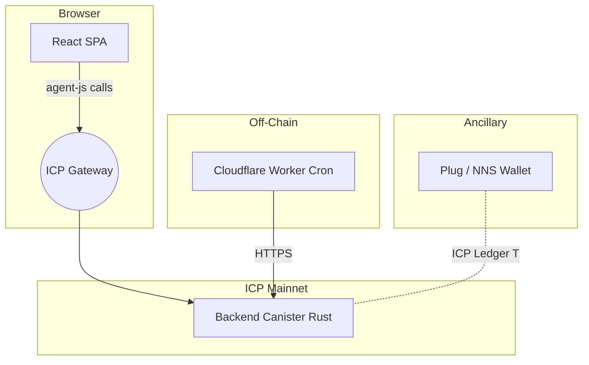
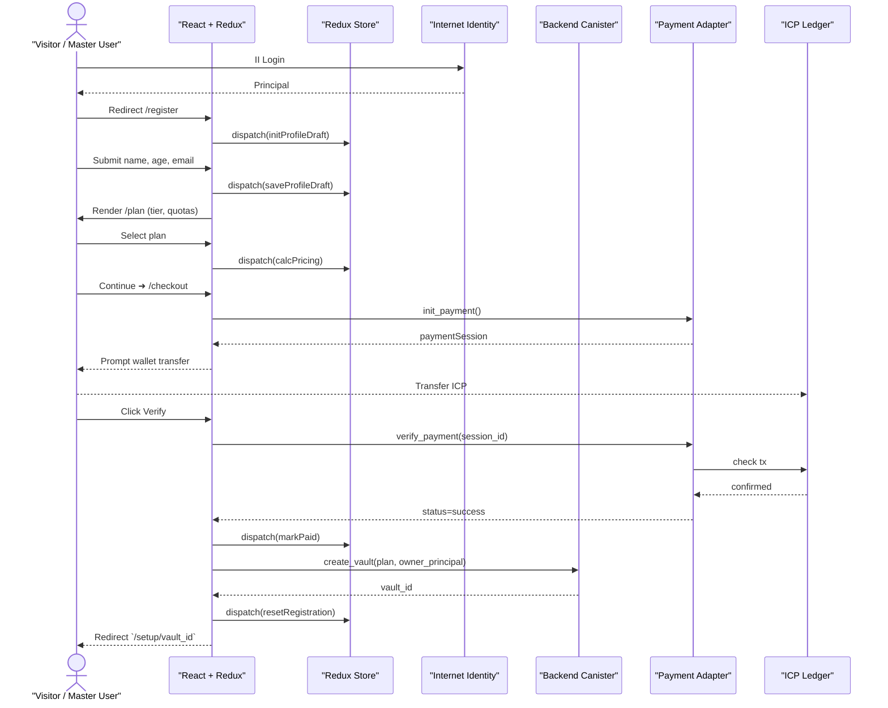
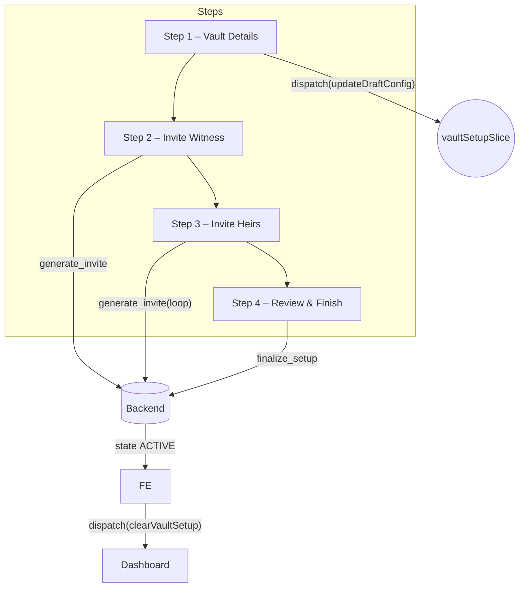
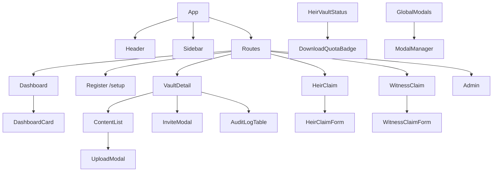
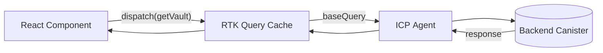

# LiVault – Frontend Architecture (Redux Variant) v1.0

> **Change‑log 2025‑04‑18**  
> • This are example of changelog should be written
> • Follow this rules for any change after version v1.0  

---

## 1. Stack Overview
| Layer | Tech Stack |
|-------|------------|
| Framework | React 18 + Vite |
| Styling | TailwindCSS v3.4 + brand theme *(branding.md)* |
| State Management | **Redux Toolkit** (+ Redux Persist) |
| Identity | Internet Identity + WebAuthn (`@dfinity/auth-client`) |
| Agent Comm | `@dfinity/agent`, `candid-js` |
| Deployment | ICP Frontend Canister (`dfx deploy`) |

### 1.1. High‑Level Architecture (Expanded)


**Key notes**
- **Frontend Canister** is purely static. All interactive requests use `@dfinity/agent` over HTTP‑upgrade to canister endpoints.
- **Redux Toolkit Query** (RTK Query) `baseQuery` wraps `agent.call` providing caching & polling.
- **Service boundaries**<br>  • Browser ↔ ICP Gateway (JSON + candid‑encoded args)<br>  • CF Worker ↔ Canister (HTTPS) – maintenance tasks.<br>  • Wallet ↔ Ledger – native ICP transfers.

### 1.2 Performance Targets
| Metric | Target | Rationale |
|--------|--------|-----------|
| First Load (TTFB) | ≤ 250 ms | Static CDN edge cache |
| SPA Boot (hydration) | ≤ 1.2 s @ 3G Fast | Budgets bundles < 150 kB gz |
| API Latency | ≤ 400 ms p95 | ICP node + Gateway round‑trip |

---

## 2. State Management (Redux)

### 2.1 Top‑Level Store Shape
```ts
interface RootState {
  auth: {
    principal: string | null;
    isAuthenticated: boolean;
    deviceInfo: string | null;
  };
  registration: {
    profileDraft: {
      name: string;
      age: number;
      email: string;
    } | null;
    pricingQuote: PricingQuote | null;
    paymentSession: PaymentSession | null;
    status: 'idle' | 'pending' | 'paid' | 'error';
  };
  vaultSetup: {
    step: number;           // 1‑4 (details ➜ witness ➜ heirs ➜ review)
    draftConfig: Partial<VaultConfig>;
    uploadQueue: File[];
  };
  vault: {
    current: VaultConfig | null;
    status: VaultStatus;    // ACTIVE | UNLOCKABLE | …
  };
  content: {
    items: VaultContentItem[];
  };
  invites: {
    activeToken: string | null;
    claimStatus: 'idle' | 'loading' | 'success' | 'error';
  };
  ui: {
    modal: string | null;
    error: string | null;
    toasts: ToastMsg[];
  };
}
```

### 2.2 Key Slices
| Slice | Purpose | Persist? |
|-------|---------|----------|
| `authSlice` | Internet Identity auth, principal & device. | ✅ (sessionStorage) |
| `registrationSlice` | On‑boarding flow: profile(name and email), plan quote, payment. | ❌ (cleared at success) |
| `vaultSetupSlice` | Multi‑step wizard state before finalising vault. | ✅ (localStorage) |
| `vaultSlice` | Active vault config & lifecycle. | ❌ |
| `contentSlice` | Encrypted content list & mutations. | ❌ |
| `inviteSlice` | Heir/Witness token claim flow. | ❌ |
| `uiSlice` | Global modals, errors, notifications. | ✅ (session) |

> **Why persist wizard?** — If user refreshes mid‑setup, localStorage keeps draft so they can resume.

### 2.3 Middleware & Utilities
* **`redux-thunk`** (default Toolkit) — async agent calls.  
* **`redux-persist`** — selective slices.  
* **`retryMiddleware`** — auto‑replay failed uploads/chunks.  
* **`unlockWebSocketMiddleware`** *(future)* — push state updates to heirs.

---

## 3. Route Map (Expanded)

| Path | Page Component | Description | State |
|------|----------------|-------------|-------|
| `/register` | **Register** | Post‑II sign‑in form to capture *name, age, email* | `registration` |
| `/plan` | **PlanSelector** | Choose storage tier, heirs/witness quotas → pricing | `registration` |
| `/checkout` | **Checkout** | Wallet payment UI (`init_payment`) | `registration` |
| `/setup/:vaultId` | **SetupWizard** | 4‑step wizard (Details ➜ Witness ➜ Heirs ➜ Review) | `vaultSetup` |
| `/setup/:vaultId/done` | **SetupDone** | Confirmation screen, redirects to Dashboard | `vaultSetup` |
| `/` | **Dashboard** | List vaults + summary | `vault` |
| `/vault/:id` | **VaultDetail** | Manage vault / content | `vault`, `content` |
| `/heir/invite/:token` | **HeirClaim** | Claim token form | `invite` |
| `/witness/invite/:token` | **WitnessClaim** | Claim token form | `invite` |
| `/admin` | **AdminOverview** | KPIs | `ui` |
| `/admin/billing` | **AdminBilling** | Ledger view | `ui` |
| `/admin/logs` | **AdminLogs** | Logs console | `ui` |

> **Navigation Guard** — `/setup/*` blocked if vault status ≠ `NEED_SETUP` or user ≠ owner.

---

## 4. Flow Diagrams

### 4.1 Registration + Vault Creation (Happy Path)


### 4.2 Setup Wizard Flow (4 Steps)

*Wizard is controlled via `vaultSetupSlice.step` and persisted (localStorage) to survive reloads.*

---

## 5. Component Hierarchy (Updated)
```text
<App>
 ├── <AuthProvider/IIContext>
 ├── <ReduxProvider>
 ├── <Router>
 │   ├── <RegisterRoutes>
 │   │     ├── /register ➜ <RegisterForm>
 │   │     ├── /plan ➜ <PlanSelector>
 │   │     └── /checkout ➜ <Checkout>
 │   ├── <SetupRoutes>
 │   │     └── /setup/:vaultId/* ➜ <SetupWizard>
 │   ├── <DashboardRoutes>
 │   │     └── /vault/:id ➜ <VaultDetail>
 │   └── ... (admin, invite)
 └── <GlobalModals/Toasts>
```

---

## 6. Data Fetching Patterns
| Pattern | Library | Notes |
|---------|---------|-------|
| **RTK Query (opt‑in)** | `createApi` | Candid calls mapped to `getVault`, `createVault`, etc.; auto‑cache per vaultId. |
| **Thunk** | Hand‑rolled async for payment verify & file upload (more granular control). |
| **useEffect polling** | For live payment status while waiting for ledger confirmation. |

---

## 7. Error Handling UX
| Error | Redux Path | UI Reaction |
|-------|-----------|-------------|
| `ERR_PAYMENT_TIMEOUT` | `registration.error` | Sticky banner on `/checkout` with retry CTA. |
| `ERR_TOKEN_EXPIRED` | `invite.claimStatus='error'` | Redirect to Expired Invite page (`heir.wireframe`). |
| `ERR_APPROVAL_QUORUM_NOT_MET` | Toast via `uiSlice` | Modal alert, auto‑refresh status. |
| `ERR_RATE_LIMIT_DOWNLOAD` | `ui.error` | Modal + disables Download buttons until tomorrow. |

---

## 8. Detailed Component Breakdown (Wireframe‑Driven)

Below is a **component reference library** generated from all `*.wireframe.md` files. Each component is listed with its **ownership domain**, a concise role description, and notable Redux slice dependencies.

| Component | Domain / Page | Purpose / Interaction | Connected Slice(s) |
|-----------|---------------|-----------------------|---------------------|
| **Header** | Global | Branding, nav links, notifications (🔔), help ❓, profile dropdown | `auth`, `ui` |
| **Sidebar** | Authenticated Pages | Contextual nav (Dashboard / Vault / Admin) | `auth`, `ui` |
| **Footer** | Global | Copyright © 2025, legal links | — |
| **DashboardCard** | Master, Heir, Witness | Shows vault summary (#heirs, status, expiry) | `vault` |
| **VaultTable** | Master Dashboard | Lists user’s vaults with actions (`Open`, `Continue Setup`) | `vault` |
| **SetupWizard** | Register → Setup | Multi‑step flow (Vault Details → Witness → Heirs → Done) | `vault`, `invites`, `content`, `ui` |
| **PlanSelector** | Register | Storage + heirs/witness picker, price calculator | `ui` |
| **PaymentCheckout** | Register | ICP / ChainFusion payment UI, Verify Payment polling | `auth`, `ui` |
| **VaultDetail** | Master Vault Page | Tabs: Content, Heirs, Witness, Settings, Audit | `vault`, `content`, `invites` |
| **ContentList** | VaultDetail → Content Tab | Encrypted items table + actions | `content`, `ui` |
| **UploadModal** | Content Tab | File/Letter/Password new‑item wizard | `content`, `ui` |
| **InviteModal** | VaultDetail → Heirs/Witness | Send invite, regenerate, revoke | `invites`, `ui` |
| **HeirClaimForm** | Heir Invite | Claim invite (II login, passphrase) | `auth`, `invites` |
| **WitnessClaimForm** | Witness Invite | Similar to HeirClaimForm + trigger unlock ability flag | `auth`, `invites` |
| **HeirVaultStatus** | Heir Dashboard | Approval button, QR/passphrase submission | `vault`, `ui` |
| **WitnessVaultStatus** | Witness Dashboard | Trigger Unlock button + quorum status | `vault`, `ui` |
| **AdminOverview** | Admin | KPIs, recent activity, storage/cycle gauges | `ui` |
| **BillingLedger** | Admin → Billing | Transactions table, CSV/PDF export | `ui` |
| **LogsConsole** | Admin → Logs | Vault/System log search & table | `ui` |
| **AuditLogTable** | VaultDetail → Audit | Per‑vault actions list | `vault` |
| **DownloadQuotaBadge** | Heir View | Shows remaining downloads today | `content` |
| **ErrorToast** | Global | Displays error codes (e.g. `ERR_RATE_LIMIT_DOWNLOAD`) | `ui` |
| **RecoveryQRFlow** | Stand‑alone route | Scan/upload QR, passphrase input, unlock logic | `vault`, `ui` |
| **ModalManager** | Global | Central registry for all modals; renders based on `ui.modal` | `ui` |

> **Design note:** Atomic components like **Button**, **Input**, **Select**, **Badge** follow Tailwind + headless‑UI style and are omitted for brevity.

### 8.1 Component Dependency Graph


### 8.2 Redux Slice Touch‑Points
- **authSlice** → guards private routes; Header profile menu depends on `auth.principal`.
- **vaultSlice** → single‑source‑of‑truth for currently opened vault (`vault.config`).
- **contentSlice** → queried only when VaultDetail mounts; lazy‑cleared on unmount.
- **invitesSlice** → drives both invite modals (Master) and claim forms (Heir/Witness).
- **uiSlice** → global modal visibility and toast queue.

### 8.3 Wireframe → Component Map (Coverage Check)
| Wireframe File | Covered Components |
|----------------|--------------------|
| `owner.wireframe.md` | Header, DashboardCard, VaultTable, SetupWizard, VaultDetail, UploadModal, InviteModal, AuditLogTable |
| `heir.wireframe.md` | HeirClaimForm, HeirVaultStatus, DownloadQuotaBadge |
| `witness.wireframe.md` | WitnessClaimForm, WitnessVaultStatus |
| `admin.wireframe.md` | AdminOverview, BillingLedger, LogsConsole |

All UI views in wireframes now map to explicit React components, ensuring design‑to‑code traceability.

---

## 9. Component Prop Interfaces & Custom Hooks (TypeScript)

> Naming convention: **PascalCase React components**, `useCamelCase` hooks, **Props** prefixed with same component name e.g., `HeaderProps`.

### 9.1 Global UI Shell

```ts
// Header.tsx
export interface HeaderProps {
  principal: string | null;
  unreadCount: number;          // notifications badge
  onLogout(): void;
}

// SidebarNav.tsx
export interface SidebarNavProps {
  role: 'master' | 'heir' | 'witness' | 'admin';
  activeRoute: string;
}
```

### 9.2 Dashboard Tiles & Tables

```ts
// SummaryCard.tsx
export interface SummaryCardProps {
  label: string;
  value: number | string;
  icon?: React.ReactNode;
  color?: string;               // tailwind class, e.g. 'text-brand'
}

// VaultTable.tsx
export interface VaultTableProps {
  rows: VaultRow[];
  onOpen(vaultId: string): void;
}
export interface VaultRow {
  id: string;
  name: string;
  status: VaultStatus;
  expiresAt?: string;           // ISO string
  heirs: string;               // "1 / 3"
  witness: string;             // name or "—"
}
```

### 9.3 Vault Detail Components

```ts
// VaultStatusBanner.tsx
export interface VaultStatusBannerProps {
  status: VaultStatus;
  unlockOn?: string;           // human‑friendly date string
  approvals: {
    heirs: string;            // "2 / 3"
    witness: string;          // "0 / 1"
  };
}

// UploadContentModal.tsx
export interface UploadContentModalProps {
  isOpen: boolean;
  onClose(): void;
  onUploaded(item: VaultContentItem): void;
}
```

### 9.4 Invite & Claim Flow

```ts
// InviteClaimForm.tsx (shared by Heir & Witness)
export interface InviteClaimFormProps {
  token: string;
  role: 'heir' | 'witness';
  initialName?: string;
  onClaimed(profile: MemberProfile): void;
}
```

### 9.5 Modal & Utility Components

```ts
// ConfirmModal.tsx
export interface ConfirmModalProps {
  title: string;
  message: string;
  confirmLabel?: string;
  loading?: boolean;
  onConfirm(): void;
  onCancel(): void;
}
```

### 9.6 Admin Console

```ts
// MetricsTile.tsx
export interface MetricsTileProps {
  label: string;
  value: string | number;
}

// LedgerTable.tsx
export interface LedgerTableProps {
  txs: BillingTx[];
  onExportCSV(): void;
}
```

---

### 9.7 Custom Hooks (Redux + Side‑Effects)

| Hook | Purpose | Internals | Typical Usage |
|------|---------|-----------|---------------|
| `useAuth()` | Auth & principal data | `useSelector(authSlice)` | `const { principal, signIn, signOut } = useAuth();` |
| `useVault(vaultId)` | Fetch & subscribe to single vault | `createAsyncThunk(getVault)` + polling | `const { config, refresh } = useVault(id);` |
| `useContentUpload()` | Encapsulate chunked upload flow | `createAsyncThunk(begin/upload/finish)` | `const upload = useContentUpload(); upload(file)` |
| `useInviteToken(token)` | Validate & claim invite | dispatches `inviteSlice/claim` | auto‑redirects on success |
| `useNotifications()` | Toast / badge handling | `uiSlice` selectors | push cross‑app alerts |
| `useAdminMetrics()` | Aggregated system KPIs | RTK Query endpoint `/admin/metrics` | charts & tiles |

#### Example Implementation – `useVault`

```ts
export const useVault = (vaultId?: string) => {
  const dispatch = useAppDispatch();
  const { config, status, loading, error } = useAppSelector(
    (state) => state.vault
  );

  useEffect(() => {
    if (vaultId) dispatch(fetchVaultById(vaultId));
  }, [vaultId, dispatch]);

  return {
    config,
    status,
    loading,
    error,
    refresh: () => vaultId && dispatch(fetchVaultById(vaultId)),
  };
};
```

#### Example Implementation – `useContentUpload`

```ts
export const useContentUpload = () => {
  const dispatch = useAppDispatch();
  const uploading = useAppSelector((s) => s.content.uploading);

  const upload = async (file: File, vaultId: string) => {
    const meta: FileMeta = {
      filename: file.name,
      mime_type: file.type,
      size_bytes: file.size,
    };
    const ulid = await dispatch(beginUpload({ vaultId, meta })).unwrap();

    const chunkSize = 512 * 1024;
    for (let idx = 0; idx * chunkSize < file.size; idx++) {
      const blob = file.slice(idx * chunkSize, (idx + 1) * chunkSize);
      await dispatch(uploadChunk({ ulid, idx, blob })).unwrap();
    }
    await dispatch(finishUpload({ ulid })).unwrap();
  };

  return { upload, uploading };
};
```

---

### 9.8 Storybook & Testing Notes

| Component | Story Variants | Test Assertions (RTL / Jest) |
|-----------|---------------|------------------------------|
| Header | default / authenticated / guest | renders principal, logout fires `signOut` |
| VaultStatusBanner | Active / Grace / Unlockable | shows correct colour & counts |
| InviteClaimForm | Heir vs Witness | form validates passphrase match |
| UploadContentModal | initial / uploading / success | submit triggers `upload` thunk |
| ConfirmModal | standard / loading | confirm button disabled while `loading` |

*Add new stories whenever a prop contract changes to prevent regressions.*

---

## 10. Security & Persistence Notes
* **PII** (name, email) is stored **only** in `registrationSlice` *until* paid; then purged.  
* **Draft vault config** uses `redux-persist` – encrypted **AES‑GCM key** derived from Web Crypto `crypto.subtle.generateKey`.  
* **invite tokens** never persisted; kept in memory only.

---

## 11. Data Fetching Patterns

### 11.1 Base Agent Wrapper (api/agent.ts)
```ts
import { Actor, HttpAgent, Identity } from "@dfinity/agent";

export const makeAgent = (identity?: Identity) =>
  new HttpAgent({ host: import.meta.env.VITE_IC_HOST, identity });

export const call = async <T>(method: string, ...args: any[]): Promise<T> => {
  const actor = Actor.createActor(idlFactory, {
    agent: makeAgent(window.identity),
    canisterId: import.meta.env.VITE_CANISTER_BACKEND,
  });
  return (actor as any)[method](...args);
};
```

### 11.2 RTK Query `baseQuery`
```ts
export const icpBaseQuery: BaseQueryFn<
  { method: string; args: any[] },
  unknown,
  VaultError
> = async ({ method, args }) => {
  try {
    const data = await call(method, ...args);
    return { data };
  } catch (error) {
    return { error } as any;
  }
};
```

### 11.3 Slice‑Aware Endpoints
```ts
export const vaultApi = createApi({
  reducerPath: "vaultApi",
  baseQuery: icpBaseQuery,
  tagTypes: ["Vault", "Invite", "Content"],
  endpoints: (builder) => ({
    getVault: builder.query<VaultConfig, string>({
      query: (vaultId) => ({ method: "get_vault", args: [vaultId] }),
      providesTags: (r) => [{ type: "Vault", id: r?.vault_id }],
    }),
    uploadChunk: builder.mutation<null, UploadChunkArgs>({
      query: (p) => ({ method: "upload_chunk", args: [p] }),
      invalidatesTags: (_r, _e, a) => [{ type: "Content", id: a.vaultId }],
    }),
    // …more endpoints…
  }),
});
```

### 11.4 Data‑Flow Diagram

- **Normalized Cache**: RTK Query keeps entity cache; selectors memoize to avoid re‑renders.
- **Optimistic Updates**: `uploadChunk` increments progress locally; rollback on error.
- **Polling**: `getVaultStatus` endpoint uses `pollingInterval=10_000` when vault pending unlock.

### 11.5 Error Handling & Retry
| Error Type | Strategy |
|------------|----------|
| Network / Gateway 503 | Auto‑retry ‑ exponential back‑off 3x |
| Canister custom `ERR_*` | Surface toast + actionable link (e.g. “Upgrade Plan”) |
| Identity expired | Hook `useAuthRefresh` triggers identity flow |

---

## 12. UI Guidelines & Theming

### 12.1 Color Tokens
| Token | Hex | Usage |
|-------|-----|-------|
| `brand` | `#007C91` | Primary brand accents, buttons, links |
| `accent1` | `#59B6C6` | Hover/focus rings, active states |
| `text` | `#1B3C45` | Default text & headings (light) |
| `background` | `#F1F4F5` | App background (light) |
| `neutral` | `#CED9DB` | Borders, disabled UI |
| `secondary` | `#94AEB1` | Secondary labels, icons |

> All tokens registered in **Tailwind** via `theme.extend.colors` and exported to **Figma** shared library for designers.

```js
// tailwind.config.ts (excerpt)
import { defineConfig } from 'tailwindcss';

export default defineConfig({
  darkMode: 'class', // enables .dark selector
  theme: {
    extend: {
      colors: {
        brand: '#007C91',      // primary brand teal
        accent1: '#59B6C6',    // lighter cyan accent
        text: '#1B3C45',       // deep navy for body text
        background: '#F1F4F5', // light grey‑blue app background
        neutral: '#CED9DB',    // subtle borders / dividers
        secondary: '#94AEB1',  // hover + secondary accents
      },
    },
  },
  plugins: [require('@tailwindcss/typography')],
});
```

> **Dark‑mode variant**: add a `dark` palette override if you need deeper contrast.
```ts
extend: {
  colors: {
    brand: { DEFAULT: '#007C91', dark: '#005A67' },
    …
  }
}
```
Place this config at the project root; Vite picks it up automatically (`vite‑react‑tailwind` preset). Re‑run `npm run dev` to see color token classes like `bg-brand`, `text-accent1`, etc.

### 12.2 Typography

| Role in UI | Tailwind Class | Font Family | Fallback |
|------------|---------------|-------------|----------|
| Primary Body / UI | `font-sans` | InterVariable | system‑ui |
| Headings & Emphasis | `font-heading` | "Space Grotesk" | InterVariable |
| Letters & Long‑form | `font-serif` | Merriweather | Georgia |
| Code / Data | `font-mono` | "JetBrains Mono" | SFMono‑Regular |

```js
// tailwind.config.js – fonts excerpt
export default {
  theme: {
    extend: {
      fontFamily: {
        sans: ["InterVariable", "ui-sans-serif", "system-ui"],
        heading: ["Space Grotesk", "InterVariable", "sans-serif"],
        serif: ["Merriweather", "Georgia", "serif"],
        mono: ["JetBrains Mono", "SFMono-Regular", "monospace"],
      },
    },
  },
  plugins: [require("@tailwindcss/typography")],
};
```

### 12.3 Components Style Tokens + Motion
- **Cards / Modals**: `rounded-2xl shadow-lg p-6` with `motion.div` fade‑spring.
- **Buttons**: `btn-primary` (brand), `btn-secondary` (accent hover), `btn-danger` (rose‑500).
- **Focus States**: `focus:outline-none focus-ring focus:ring-2 focus:ring-brand/60`.
- **Loading Skeleton**: `animate-pulse bg-surface/60` blocks for content fetches.

| Style Token | Tailwind Utility | Notes |
|-------------|-----------------|-------|
| Border Radius | `rounded-2xl` | Cards, modals, inputs |
| Shadow | `shadow-md` | Elevation tier 1 |
| Grid Spacing | 4 / 8 / 12 px | Adopt 4‑pt grid; enforced via `gap-2` `gap-4` |
| Padding Minimum | `p-2` | Tap target ≥ 32 px |

### 12.4 Iconography & Assets
- **Lucide‑React** icons via tree‑shaking import: `import { Shield, KeyRound } from "lucide-react"`.
- **Brand imagery**: SVG stored in `/assets/logo.svg`, colored via `currentColor` for theme adaptation.

### 12.5 Motion & Accessibility
- Animations via **Framer Motion** with 80 ms ease‑out / 120 ms ease‑in.
- Respect `prefers-reduced-motion`: components fall back to fade‑in only.
- WCAG AA contrast ≥ 4.5 between `text` and `background` as verified in Figma.

### 12.6 Dark‑Mode Strategy
- Use Tailwind `dark:` variant with **class strategy** (`<html class="dark">`).
- Background swaps to `text` token (#1B3C45) while text uses `F1F4F5`.
- Accent & brand tokens remain unchanged for consistent identity.

---

## 13. Future Enhancements
* Replace polling with WebSocket unlock events (middleware).  
* Optimistic UI for chunked uploads with resumable queue.  
* Multi‑tab concurrency guard (BroadcastChannel & `redux-queue`).

---

*Last updated: 2025‑04‑19 by ChatGPT (o3) And Prasetyowira.*