# LiVault – Product Requirements Document (PRD) v0.1

## 1. Overview
**LiVault** is a decentralized digital legacy vault built on the Internet Computer Protocol (ICP). It allows users to securely store sensitive information such as personal letters, wallet keys, and passwords, and define complex unlock conditions that reflect real-world legacy scenarios.

---

## 2. Objectives
- Enable secure and decentralized digital inheritance
- Support multi-role system: master user, heir, witness, and admin
- Allow customizable unlock logic (time, inactivity, approval)
- Operate on a one-time payment model with flexible pricing

---

## 3. User Roles
### Master User
- Creates and owns the vault
- Defines unlock conditions and content
- Pays based on selected plan

### Heir
- Invited by master user
- Approves vault unlock if needed
- Gains access to vault content after unlock conditions are met

### Witness (Optional)
- Invited as an observer or approver
- Can trigger manual unlock requests
- Has no access to vault content

### Admin (System Role)
- Monitors usage and billing
- Cannot view or alter vault content

---

## 4. Vault Lifecycle
### States:
- `DRAFT`: Vault created but unpaid
- `NEED_SETUP`: Paid but content/heir not set
- `SETUP_COMPLETE`: Setup finished, at least 1 heir claimed invite
- `ACTIVE`: Countdown to expiration starts
- `GRACE_MASTER`: 14-day grace period for master after expiration
- `GRACE_HEIR`: 14-day grace for heirs/witness after no master action
- `UNLOCKABLE`: Unlock fulfilled, vault accessible
- `EXPIRED`: Unlock period over, content inaccessible
- `DELETED`: Vault permanently removed

### Triggers:
- Payment, Setup Completion, Unlock Conditions, Scheduled Cleanup

---

## 5. Unlock Conditions
- **Time-based unlock**: Specific future date
- **Inactivity-based**: No activity from master for X days
- **Approval Threshold**:
  - e.g., 2 heirs + 1 witness
- **Recovery QR**:
  - Usable only before heir/witness setup
  - Can bypass approval or act as backup
  - Flow to issue, display, revoke QR in Settings
  - Field mapping to `recovery_qr` object in schema (enabled / bypass_threshold / valid_if_no_heir_or_witness).

---

## 6. Content Types
- **Files**: `.pdf`, `.docx`, `.xlsx`, `.jpg`, `.png`, `.txt`
- **Password lists** (downloadable .txt)
- **Personal letters** (plain text) with `to` as multiple select dropdown
- **Content stored encrypted using AES**

---

## 7. Plan & Payment
- One-time payment based on:
  - Storage quota (e.g., 50MB, 100MB, 250MB)
  - Number of heirs & witnesses
  - User's age (as life risk factor)
  
### 💸 Pricing Plan

One-time payment only. No recurring subscription. Vaults remain valid up to 10 years.

| Plan      | Storage | Heirs | Witness | Base Price (ICP)* |
|-----------|---------|-------|---------|-------------------|
| Basic     | 5 MB    | up to 2 | optional (1) | 3.5       |
| Standard  | 10 MB   | up to 3 | optional (1) | 6.9        |
| Premium   | 50 MB   | up to 5 | optional (1) | 30        |
| Deluxe    | 100 MB  | up to 8 | optional (1) | 61        |
| Titan†    | 250 MB  | up to 10 | optional (1) | 151         |

> *Base Price may increase by 0–25% depending on your age bracket.<br>
> †Titan plan is available for institutional or extended-family use cases.

---

### 👴 Actuarial Risk Factor (by Age)

| Age Bracket | Uplift |
|-------------|--------|
| ≤30         | +0%    |
| 31–40       | +5%    |
| 41–50       | +10%   |
| 51–60       | +15%   |
| 61–70       | +20%   |
| >70         | +25%   |

> The older the user, the higher the risk of early unlock, hence a pricing uplift to cover longer-term costs.

---

*Payment accepted in ICP token or any crypto via ChainFusion Swap.*

### **Price Formula**
```
AgeFactor = { 
  age <= 30: 0%, 
  age 31–40: 5%, 
  age 41–50: 10%,
  age 51–60: 15%,
  age 61–70: 20%,
  age > 70: 25% 
}
BaseStoragePrice = {
  5MB = 3.0 ICP,
  10MB = 6.0 ICP,
  50MB = 27.0 ICP,
  100MB = 55.0 ICP,
  250MB = 140.0 ICP
}
BaseHeirFee = 0.2 ICP per heir
BaseWitnessFee = 0.1 ICP (fixed per vault if enabled)
BasePrice = BaseStoragePrice + HeirWitnessFee
Plan price base + actuarial factor (0‑25 % based on age bracket)
```
> 📌 All prices are one-time payment and valid up to 10 years.  
> ✅ This pricing structure is designed to cover full ICP storage + compute costs with ~10–35% margin.  
> 🧮 Upgrade-prorate formula stays compatible with this structure.

### Accepted Payment via:
  - ICP token via icp ledger
  - ChainFusion integration (crypto swap) // Future Works

### Plan upgrade rules:
  - **prorate formula**: 
    ```
    AF = {
      age <= 30: 0%
      age 31–40: 5%
      age 41–50: 10%
      age 51–60: 15%
      age 61–70: 20%
      age > 70: 25%
    }
    BaseStoragePrice = {
      5MB = 3.0 ICP,
      10MB = 6.0 ICP,
      50MB = 27.0 ICP,
      100MB = 55.0 ICP,
      250MB = 140.0 ICP
    }
    HeirWitnessFee = (HeirCount × 0.5 ICP) + (WitnessCount × 1.0 ICP)
    BasePrice = BaseStoragePrice + HeirWitnessFee
    AdjustedPrice = BasePrice × (1 + AF)
    TimeFactor = (RemainingDays / TotalDays)
    UpgradeProratePrice = (NewAdjustedPrice - OldAdjustedPrice) × TimeFactor 
    ```

### Refund rules:
  - Not allowed to refund / cancel

### **Acceptance criterion**
- after successful verify_payment, system stores ledger Tx hash and surfaces “Download Receipt PDF” just like Billing page.

---

## 8. Invite Flow
- Master generates 1-time token (QR/link)
- Token expires in 24h
- Heir/Witness must:
  - Log in via Internet Identity
  - Enter relation, passphrase, confirm
  - Token becomes claimed, member profile created
  - **Each heir/witness receives a key**:
    - Generated using Shamir Secret Sharing
    - Stored locally and exported as QR code or offline backup

### Invite Token Management
- Regenerate (only when status=expired / revoked)
- Revoke (irreversible)
- Copy‑link action
- Acceptance criteria: token status transitions & audit entry.

---

## 9. Post-Unlock Access
- Accessible for max 1 year or until vault expires
- Access rate limit: 3x/day/user
- Downloadable content only
- UX note: badge “3/3 downloads left today” + error ERR_RATE_LIMIT_DOWNLOAD

---

## 10. Audit & Logs
- All actions logged per vault and per member
- Master, Witness (if allowed) can view logs
- Retention configurable (default 365 days)

---

## 11. Scheduled Tasks (Offchain)
- Daily:
  - Vault expiration check
  - Invite token cleanup
  - Grace period handling
  - Unlock eligibility check (optional)

---

## 12. Admin Console
**Overview**: system KPIs, cycle balance, storage used.
**Billing**: on‑chain ledger entries, CSV export, PDF receipts.
**Logs**: vault & system log search, CSV export, retention policy.

---

## 13. Future Considerations
- Email-based reminders (opt-in)
- Emergency kill switch
- Legal verification integration
- Biometric + DID recovery enhancements

---

## 14. Flow Visuals

### Vault Lifecycle State Diagram


# Master User Registration Flow

This flow describes how a Master User signs up and creates their initial vault.

```mermaid
flowchart TD
    A[Landing Page] --> B[Click “Get Started”]
    B --> C[Redirect to Internet Identity]
    C --> D{Authenticated?}
    D -- No --> E[Show II Login Error]
    D -- Yes --> F[Show Registration Form]
    F --> G[User submits personal info (name, age, email)]
    G --> H[Select Plan & Configure Vault]
    H --> I[Submit Payment in ICP Token]
    I --> J{Payment Success?}
    J -- No --> K[Display Payment Failure]
    J -- Yes --> L[Create VaultConfig in Canister]
    L --> M[Set status = NEED_SETUP]
    M --> N[Display Vault Setup Page]
```

**Notes:**
- Internet Identity (II) handles authentication; no separate password needed.
- Plan selection uses user age and storage/quota inputs to calculate cost.
- On successful payment, a new `vault_id` is generated and stored on-chain.
- User is then directed to complete vault setup (content, invites).


# Continue Setup Flow

This flow describes what happens when the Master User clicks **Continue Setup** from the internal dashboard.

```mermaid
flowchart TD
    A[Click "Continue Setup"] --> B[Edit Vault Details]
    B --> C{Vault details complete?}
    C -- No --> B
    C -- Yes --> D[Invite Witness Optional]
    D --> E{Add Another Witness?}
    E -- Yes --> D
    E -- No --> F[Invite Heirs]
    F --> F1[Enter heir name, relation, email/DID]
    F1 --> F2[Generate token & QR for Heir]
    F2 --> F3{Add more heirs?}
    F3 -- Yes --> F
    F3 -- No --> G[Review & Finalize Setup]
    G --> H[Click "Finish Setup"]
    H --> I[Validate Required Data]
    I -- No --> J[Highlight Errors & Return]
    I -- Yes --> K[Save Setup to Canister]
    K --> L[Update vault status to ACTIVE]
    L --> M[Redirect to Dashboard Active State]
```

**Notes:**
- **Edit Vault Details** allows updating vault name, unlock rules, and plan settings.
- **Invite Witness** is optional; skip if not required.
- **Invite Heirs** loops until the required number of heirs are invited and tokens generated.
- **Finalize** ensures that all mandatory steps are completed before marking the vault as ACTIVE.


### Invite & Onboarding Flow

```mermaid
flowchart TD
    A[Master generates invite] --> B{Token created}
    B --> C[QR or Link sent to target]
    C --> D[User opens link and logs in]
    D --> E[Fill relation + set passphrase]
    E --> F[Token claimed → vault_member created]
    F --> G[Key generated - Shamir share]
    G --> H[Key delivered as QR or offline]
```



### Unlock Condition Evaluation Logic


### Recovery QR Unlock Path


### Off-chain Scheduler Task Flow


# 15. User Stories & Acceptance Criteria

| ID | User Story (As a … I want … so that …) | Acceptance Criteria |
|----|-----------------------------------------|---------------------|
| US‑01 | **Master User**: *As a Master User, I want to create a vault and pay in ICP tokens so that my sensitive data is secured for 10 years.* | 1. Payment succeeds with ICP or ChainFusion.<br>2. Vault status transitions to `NEED_SETUP`.<br>3. A unique `vault_id` is returned in the response. |
| US‑02 | **Master User**: *I want to invite heirs and witnesses via QR/link so that they can participate in the unlock process.* | 1. System generates a one‑time token valid for 24 h.<br>2. Token contains correct role metadata (`heir`/`witness`).<br>3. Invitee receives link/QR successfully. |
| US‑03 | **Heir**: *As an Heir, I want to claim my invitation and set a passphrase so that I can approve the vault unlock in the future.* | 1. Invite link opens a secure claim page.<br>2. Heir logs in via Internet Identity.<br>3. Passphrase is confirmed twice and stored only client‑side.<br>4. Token status updates to `claimed` and member status to `active`. |
| US‑04 | **Witness**: *As a Witness, I want to trigger an unlock request when the Master User has passed away so that heirs can access the vault.* | 1. Witness dashboard shows “Trigger Unlock” after expiry or inactivity.<br>2. System validates required approvals and time conditions.<br>3. Upon success, vault state changes to `UNLOCKABLE`. |
| US‑05 | **Heir**: *I want to download vault content once it is unlocked so that I can access the Master User’s legacy data.* | 1. Vault is in `UNLOCKABLE` state.<br>2. Daily download limit (3) is enforced.<br>3. Download link expires after 1 hour or 1 use. |
| US‑06 | **Scheduler**: *As the system, I want to automatically purge expired vaults so that storage costs remain predictable.* | 1. Off‑chain cron runs daily.<br>2. Vaults past post‑unlock window are marked `EXPIRED` and then `DELETED`.<br>3. Audit log captures purge event. |
| US‑07 | **Master User**: *I want to regenerate an invitation token if the previous one expired so that my heir can still join.* | 1. System verifies original token is `expired`.<br>2. A fresh token with new `token_id` and 24 h validity is issued.<br>3. Old token cannot be re‑claimed. |
| US‑08 | **Security**: *As the platform, I want to reject unlock attempts that don’t meet approval quorum so that unauthorized parties cannot access data.* | 1. If required heir/witness approvals are not met, system returns `ERR_APPROVAL_QUORUM_NOT_MET`.<br>2. Failed attempt is logged with the actor’s principal ID.<br>3. Rate‑limit of 5 failed unlock attempts/hour. |
| US‑09 | **Master User**: *I want to update vault content during the active period so that new information is preserved.* | 1. Vault status is `ACTIVE`.<br>2. New or updated files are encrypted client‑side before upload.<br>3. Storage quota checks pass.<br>4. `updated_at` timestamp is recorded. |
| US‑10 | **Audit Viewer**: *As an Admin, I want to view aggregated usage metrics without seeing vault contents so that I can monitor system health while preserving privacy.* | 1. Admin API returns counts (active vaults, storage usage) but not sensitive data.<br>2. Response time < 200 ms for < 1000 vaults.<br>3. Endpoint authenticated via admin principal. |


---

# 16. Assumptions, Constraints & Out-of-Scope

## Assumptions
- All users have an Internet Identity (II) and access to WebAuthn-supported browsers or devices.
- Vaults can only be accessed online (offline-first mode is not supported).
- Master Users are expected to manage and finalize vault setup before it becomes locked.
- The off-chain scheduler runs reliably and can consistently hit canister endpoints without fail.

## Constraints
- Maximum storage is enforced by plan type (e.g., 10MB, 50MB, 100MB).
- Heir and witness counts are capped based on the chosen plan.
- Unlock by inactivity depends on off-chain monitoring of session activity or logins.
- Recovery QR can only be used before the setup is complete (before any heir or witness has successfully joined).

## Out-of-Scope
- ❌ **Email Notifications & Reminders**  
  Automated email reminders for expiry warnings, claim invitations, or unlock events are not implemented in v1.

- ❌ **Legal Validation or Registered Notary Integration**  
  Vault contents are not legally binding or endorsed by certified legal entities. Future partnerships may enable this.

- ❌ **Multi-chain Payment Support**  
  Only ICP Token and ChainFusion-based conversions are accepted. Support for ETH, USDT, or other chains is out of scope.

- ❌ **Cross-Device Biometric Key Sync**  
  WebAuthn biometric credentials are device-specific. Synchronization across devices is not supported at this stage.


## 17. Appendices
- `vault_config.json`
- `vault_member.json`
- `vault_invite_token.json`
- Vault state diagram
- Unlock condition logic
- [LiVault – Branding & UI Design Document](branding.md).


*Last updated: 2025‑04‑19 by ChatGPT (o3) And Prasetyowira.*