# 🧭 LiVault – Project Overview

**LiVault** is a decentralized digital legacy vault built on the Internet Computer Protocol (ICP). It enables users to securely store sensitive personal data—such as wallet credentials, letters, and important documents—and define unlock conditions that reflect real-world legacy needs (e.g., time-based, inactivity, multi-party approvals).

---

## 🎯 Purpose & Vision

LiVault is designed to preserve digital legacies by combining:
- ✅ Client-side encryption (AES-256 + Shamir Secret Sharing)
- ✅ Role-based access control (Master, Heir, Witness, Admin)
- ✅ Flexible unlock logic (inactivity, time, quorum, QR fallback)
- ✅ One-time pricing model based on actuarial risk & storage

---

## 🔗 Core Modules

| Area | Description | Linked Docs |
|------|-------------|-------------|
| 📜 Product Requirements | Functional specs, user flows, pricing logic | [prd.md](prd.md) |
| 🧑‍💻 User Journeys | Full sequence diagrams for each role | [user.journey.md](user.journey.md) |
| 🖼 Wireframes | UI/UX breakdown per user role | [*.wireframe.md](#📚-wireframe-index) |
| 🖥 Frontend Architecture | React + Vite + Redux with Tailwind | [frontend.architecture.md](frontend.architecture.md) |
| 🧠 Backend Architecture | Rust canister on ICP, stable memory, crypto | [backend.architecture.md](backend.architecture.md) |
| ⚙️ Technical Implementation | Payment flows, data storage, candid service | [tech.docs.md](tech.docs.md) |
| 🎨 Branding | Fonts, color tokens, Tailwind config | [branding.md](branding.md) |
| 🎨 Sitemap | list of frontend routes | [sitemap.md](sitemap.md) |

---

## 🧱 Data Schemas

| Schema | Description |
|--------|-------------|
| [vault_config.schema.json](vault_config.schema.json) | Core vault metadata, state, plan, rules |
| [vault_member.schema.json](vault_member.schema.json) | Heir/Witness identity, approval state, logs |
| [vault_invite_token.schema.json](vault_invite_token.schema.json) | One-time invite tokens for onboarding |
| [vault_content_item.schema.json](vault_content_item.schema.json) | Encrypted content blobs: files, passwords, letters |

---

## 👥 User Roles

| Role | Description |
|------|-------------|
| **Master** | Vault creator, defines unlock rules & content |
| **Heir** | Invited to approve unlocks; gets access post-approval |
| **Witness** | Optional approver who can trigger unlock |
| **Admin** | System observer, views logs & billing (no content access) |

---

## 📚 Wireframe Index

| File | Role / Section |
|------|----------------|
| [owner.wireframe.md](owner.wireframe.md) | Master user flow |
| [heir.wireframe.md](heir.wireframe.md) | Heir claim, approve, download |
| [witness.wireframe.md](witness.wireframe.md) | Witness trigger, vault watch |
| [admin.wireframe.md](admin.wireframe.md) | Internal dashboard, billing, logs |
| [discovery.wireframe.md](discovery.wireframe.md) | discovery flow |
| [landing.wireframe.md](landing.wireframe.md) | landing page for marketing |

---

## 🧪 Key Technical Features

- 🔐 Encrypted Upload API: supports file, password, and letter types
- 🧩 Smart Quorum Checks: unlock only when `n-of-m` approval is met
- 🧯 Recovery QR: optional override path pre-setup
- 📈 Admin Metrics: real-time stats via `get_metrics()`
- 💸 Payment Adapter: native ICP or ChainFusion (multi-token) support
- 📋 Audit Logs: per-vault immutable logs, append-only
- 🚦 Rate Limiting: token-bucket per principal (transient memory only)

---

## 🔐 Cryptographic Stack

| Component | Algorithm |
|-----------|-----------|
| File encryption | AES-256-GCM |
| Key splitting | Shamir Secret Sharing |
| Transport auth | WebAuthn (Internet Identity) |
| QR Recovery | SHA-256 hash + encoded payload |

---

## 📈 Lifecycle at a Glance

```mermaid
stateDiagram-v2
  [*] --> DRAFT
  DRAFT --> NEED_SETUP: payment_success
  NEED_SETUP --> SETUP_COMPLETE: config + invite sent
  SETUP_COMPLETE --> ACTIVE: ≥1 heir joined
  ACTIVE --> GRACE_MASTER: expiration hit
  GRACE_MASTER --> GRACE_HEIR: 14d no response
  GRACE_HEIR --> UNLOCKABLE: quorum met or QR used
  GRACE_HEIR --> DELETED: no quorum for 14d
  UNLOCKABLE --> EXPIRED: 1y or manual cleanup
  EXPIRED --> DELETED
```

## 📂 Example Data Content
- [vault_config.json](vault_config.json) – example config with rules and members
- [vault_member.json](vault_member.json) – sample heir record (Putri Wira)
- [vault_invite_token.json](vault_invite_token.json) – example token state
- [vault_content_item_file.json](vault_content_item_file.json)
- [vault_content_item_password.json](vault_content_item_password.json)
- [vault_content_item_letter.json](vault_content_item_letter.json)

## Traceability Matrix
| Feature / Functionality | User Journey | PRD Reference | Schema(s) | Wireframe(s) | Backend Endpoint(s) | Frontend Component(s) |
|-----------|-----------|-----------|-----------|-----------|-----------|-----------|
| Create Vault & Payment | Discover → Sign-Up → Plan Selection & Payment | Section 7 (Plan & Payment), US‑01 | vault_config.schema.json | discovery.wireframe.md, landing.wireframe.md | init_payment, verify_payment, create_vault | PlanSelector, PaymentCheckout|
| Vault Setup Wizard | Vault Setup | Section 4 (Vault Lifecycle), US‑02 | vault_config.schema.json, vault_content_item.schema.json | owner.wireframe.md (Setup Wizard) | update_vault, upload_chunk, finish_upload | SetupWizard, UploadModal |
| Invite Heir/Witness | Vault Setup → Invite Heirs/Witness | Section 8 (Invite Flow), US‑02 | vault_invite_token.schema.json | owner.wireframe.md, heir.wireframe.md, witness.wireframe.md | generate_invite | InviteModal, HeirClaimForm, WitnessClaimForm |
| Claim Invite & Key | Heir/Witness → Claim Flow | Section 8, US‑03 | vault_member.schema.json | heir.wireframe.md, witness.wireframe.md | claim_invite | InviteClaimForm |
| Unlock & Approval Flow | Unlock Request | Section 5 (Unlock Conditions), US‑04, US‑08 | vault_config.schema.json, vault_member.schema.json | heir.wireframe.md, witness.wireframe.md | trigger_unlock | HeirVaultStatus, WitnessVaultStatus |
| Post-Unlock Access | Post-Unlock Access | Section 9, US‑05 | vault_content_item.schema.json | heir.wireframe.md (Unlocked View) | request_download | ContentList, DownloadQuotaBadge |
| Audit & Logs | Post-Unlock + Admin Dashboard | Section 10, US‑10 | vault_member.schema.json | owner.wireframe.md (Audit), admin.wireframe.md | get_metrics, daily_maintenance | AuditLogTable, AdminOverview |

## 🧠 Future Enhancements
- ⚡ Async ledger streaming (no polling)
- 📧 Email notifications (claim / expiry)
- 🧾 Legal notary & KYC integration
- 🧿 NFT-hardened vault claims
- 🔐 Secure QR transfer across devices
