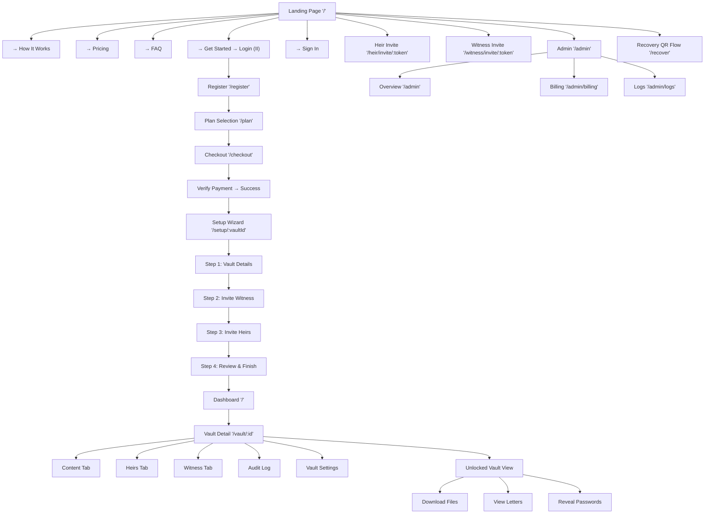

```mermaid
graph TD
    %% Top-level Pages
    A["Landing Page '/'"] --> A1[→ How It Works]
    A --> A2[→ Pricing]
    A --> A3[→ FAQ]
    A --> A4["→ Get Started → Login (II)"]
    A --> A5[→ Sign In]

    %% Registration & Payment
    A4 --> B1["Register '/register'"]
    B1 --> B2["Plan Selection '/plan'"]
    B2 --> B3["Checkout '/checkout'"]
    B3 --> B4[Verify Payment → Success]
    B4 --> B5["Setup Wizard '/setup/:vaultId'"]

    %% Setup Wizard Steps
    B5 --> C1[Step 1: Vault Details]
    C1 --> C2[Step 2: Invite Witness]
    C2 --> C3[Step 3: Invite Heirs]
    C3 --> C4[Step 4: Review & Finish]

    %% Post Setup → Dashboard
    C4 --> D["Dashboard '/'"]
    D --> D1["Vault Detail '/vault/:id'"]
    D1 --> D1a[Content Tab]
    D1 --> D1b[Heirs Tab]
    D1 --> D1c[Witness Tab]
    D1 --> D1d[Audit Log]
    D1 --> D1e[Vault Settings]

    %% Invite Flow (Heir/Witness)
    A --> E1["Heir Invite '/heir/invite/:token'"]
    A --> E2["Witness Invite '/witness/invite/:token'"]

    %% Post-Unlock View
    D1 --> F[Unlocked Vault View]
    F --> F1[Download Files]
    F --> F2[View Letters]
    F --> F3[Reveal Passwords]

    %% Admin Panel
    A --> G["Admin '/admin'"]
    G --> G1["Overview '/admin'"]
    G --> G2["Billing '/admin/billing'"]
    G --> G3["Logs '/admin/logs'"]

    %% Standalone
    A --> H["Recovery QR Flow '/recover'"]
```