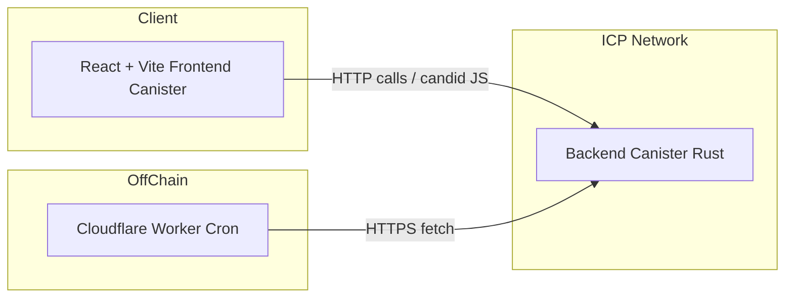

# LiVault – Technical Design Docs (MVP)

> **Target:** Internet Computer / Rust (wasm32‑unknown‑unknown), 2024 edition

---

## 0. Tech Stack Overview

### Backend (Canister Logic)
| Layer | Stack |
|-------|-------|
| Language | Rust 2024 (async/await, trait-driven) |
| Target | `wasm32-unknown-unknown` (compiled via `cargo +nightly build --release`) |
| Frameworks | None (custom IC canister logic) |
| Crypto | `aes-gcm`, `sha2`, `rand`, `shamir-secret-sharing` |
| Stable Memory | `ic-stable-structures`, `serde_cbor` |
| Testing | `cargo test`, `dfx` local testing |

### Frontend (Web UI)
| Layer | Stack |
|-------|-------|
| Language | TypeScript |
| Framework | React 18 + Vite |
| Styling | TailwindCSS v3.4.1 + Custom Theme (see branding.md) |
| Identity | Internet Identity + WebAuthn via `@dfinity/auth-client` |
| State Management | `zustand` (lightweight), custom context for vault/session |
| Communication | `@dfinity/agent`, `candid-js` |
| Deployment | Internet Computer frontend canister via `dfx deploy` |

---

## 1. High‑Level Architecture

- **Frontend Canister:** Static assets + WASM glue for Internet Identity / WebAuthn.
- **Backend Canister:** All business logic, stable memory storage, Candid interface.
- **Cloudflare Worker:** Daily cron (free tier) triggers lifecycle transitions.

### Performance Targets (MVP)
- QPS expectation: ≤ 5 req/s (startup phase).
- Vault growth: ≈ 10 vaults / month.

---

## 1.1 Payment Adapter

| Mode | Flow | Notes |
|------|------|-------|
| `IcpDirect` | User pays vault price directly from NNS / Plug wallet.<br>Tx‑hash is polled via `verify_payment`. | Zero slippage, cheapest gas. |
| `ChainFusionSwapper` | User can send any supported token.<br>ChainFusion swaps → ICP → canister principal address. | Adds 3–5 sec latency; fee displayed before confirm. |

---

## 2. Canister Module Layout (Rust)
```
src/backend/
  lib.rs         // Canister entry, init + heartbeat
  api.rs         // Candid exposed functions
  models/
    vault.rs
    member.rs
    invite.rs
  services/
    vault_service.rs
    invite_service.rs
    scheduler.rs
  utils/
    crypto.rs
    error.rs
```
- **Compilation target:** `wasm32-unknown-unknown` (IC toolchain, Rust 2024).

## 2.1 Chunked File Upload API

| Step | Endpoint | Payload |
|------|----------|---------|
| 1 | `begin_upload(vault_id, FileMeta)` | returns `upload_id` (ULID) |
| 2 | `upload_chunk(upload_id, idx, blob)` | 512 KB max per call |
| 3 | `finish_upload(upload_id, sha256)` | validates size & checksum |

`FileMeta = { filename, mime_type, size_bytes }`

Stable‑memory staging buffer stored under `upload_id` until `finish_upload`.

## 2.2 Shamir Share Index Allocation
Inside `invite_service.rs`:

```rust
fn next_free_index(vault: &VaultConfig, role: Role) -> u8 {
    let used: BTreeSet<u8> = vault.members(role)
        .iter()
        .map(|m| m.shamir_share_index)
        .collect();
    (1..=255).find(|i| !used.contains(i)).expect("share exhaused")
}
```

---

## 3. Candid Interface (Stub)
```candid
type PaymentInit = record {
  vault_plan      : text;
  amount_e8s      : nat64;
  method          : variant { icp_direct; chainfusion };
};

type PaymentSession = record {
  session_id : text;
  pay_to_principal : principal;
  amount_e8s : nat64;
  expires_at : nat64;
};

service : {
  init_payment   : (PaymentInit)   -> (PaymentSession);
  verify_payment : (PaymentSession) -> (result text, VaultError);
  create_vault : (VaultInit)               -> (text);
  get_vault    : (text)                    -> (opt VaultResponse);
  update_vault : (text, VaultUpdate)       -> (Result<(), VaultError>);
  generate_invite : (text, Role)           -> (InviteToken);
  claim_invite    : (text)                 -> (Result<MemberProfile, VaultError>);
  trigger_unlock  : (text)                 -> (Result<(), VaultError>);
  daily_maintenance : ()                   -> ();   // called by Worker
}
```

---

## 4. HTTP API Gateway
- **Transport:** IC HTTP outcall from frontend (agent‑js)
- **Auth:** Internet Identity delegation header + WebAuthn assertion where needed
- **Rate‑Limit:** 20 req / min / principal (canister‑level buckets)

## 4.1 Frontend Route Map
| Path | Component |
|-----|-----------|
| / | Dashboard |
| /vault/:id | VaultDetail |
| /heir/invite/:token | HeirClaim |
| /witness/invite/:token | WitnessClaim |
| /admin | AdminOverview |
| /admin/billing | AdminBilling |
| /admin/logs | AdminLogs |

---

## 5. Data Model & Storage
- **Schemas:** see `vault_config.json`, `vault_member.json`, `vault_invite_token.json`, and `vault_content_item.json`.
- **Stable Memory Layout:**
  - `HashMap<Principal, VaultConfig>`  → stores vault metadata and plan
  - `HashMap<TokenId, InviteToken>`   → invite and claim tokens
  - `BTreeMap<VaultId, Vec<VaultContentItem>>`  → indexed content list per vault
  - `Vec<LogEvent>` per vault         → append-only audit logs
  
### 5.1 Vault Content Representation:
```rust
struct VaultContentItem {
  id: String,
  type: ContentType, // file | password | letter
  title: Option<String>,
  created_at: u64,
  updated_at: u64,
  payload: Vec<u8>, // Encrypted content blob
}
```
- `payload` contains encrypted JSON per type (e.g. file_meta, password_entry, letter)
- **Encryption done client-side**, only encrypted blob reaches the canister
- File uploads: file itself is encrypted + uploaded in chunks, referenced in the vault content by ID
- Optional checksum verification at upload for extra integrity

### 5.2 Daily Access‑Limit Guard

```rust
fn check_download_quota(member: &mut VaultMember) -> Result<()> {
    let today = day_index(ic_time());
    if member.access.last_day != today {
        member.access.last_day = today;
        member.access.count = 0;
    }
    if member.access.count >= 3 {
        return Err(VaultError::RateLimit);
    }
    member.access.count += 1;
    Ok(())
}

```

---

## 6. Cryptography
| Purpose | Algorithm |
|---------|-----------|
| Vault content | AES‑256‑GCM (client‑side) |
| Key shares | Shamir Secret Sharing (threshold configurable) |
| Transport auth | WebAuthn (FIDO2) challenge signed by device TEE |
| Recovery QR | SHA‑256 hash of share + vault_id, encoded as QR |

---

## 7. Off‑Chain Scheduler Spec
- **Platform:** **Cloudflare Workers Cron Triggers (free plan)**
- **Frequency:** once per day at 02:00 UTC.
- **Endpoints called:** `/daily_maintenance` (no args).
- **Retry:** Exponential back‑off (1 min, 5 min, 15 min, give up).
- **Timeout:** 10 s per call.

---

## 8. Deployment & CI/CD
- **Repo Host:** GitHub
- **Pipeline:** GitHub Actions
  - `cargo check` → `cargo test` → `cargo wasm` → `dfx deploy --no-wallet --network ic`
- **Secrets:** Stored in GitHub Actions Secrets (`DFX_IDENTITY_PEM`, `CF_API_TOKEN`).
- **Cycle Management:** Post‑deploy job tops up canister with minimal cycles via `ic-admin`.
- **Canister Split:** `frontend_canister` (assets) + `backend_canister` (logic).


## 8.1 Environment Matrix
| Env | DFX_NETWORK | Purpose |
|-----|------------|--------|
| local | local | CI unit & integration tests |
| prod | ic | Mainnet |

Secrets: `DFX_IDENTITY_PEM`, `CF_API_TOKEN`, `WEBHOOK_URL`.

---

## 9. Observability
- **Logging:** Bunyan‑style JSON logs to canister console.
- **Metrics:** Simple counters exposed via candid: `get_metrics() -> VaultMetrics`.
- **Dashboard:** IC dashboard + log tail; no Prometheus in MVP.

---

## 10. Security Hardening
- Content‑Security‑Policy headers on frontend pages.
- Upload whitelist + size check client‑side.
- Rate‑limit & nonce per unlock attempt (prevent replay).
- All errors return `string_code` + message (English).

---

## 11. Testing Strategy
- **Rust unit tests:** logic & crypto utils.
- **dfx integration tests:** spawn local IC, execute invite/claim/unlock flow.

---

## 12. Error Codes (Excerpt)
| Code | Message |
|------|---------|
| `ERR_TOKEN_EXPIRED` | Invitation token has expired |
| `ERR_NOT_AUTHORIZED` | Caller is not allowed to perform this action |
| `ERR_APPROVAL_QUORUM_NOT_MET` | Required heir/witness approvals not satisfied |
| `ERR_STORAGE_LIMIT` | Upload exceeds plan quota |
| `ERR_QR_BLOCKED_POST_SETUP` | Recovery QR invalid after heirs/witness joined |
| `ERR_UPLOAD_CHUNK_OUT_OF_ORDER` | Received chunk index not sequential |
| `ERR_CYCLE_LOW` | Operation denied: cycle balance too low |

---

## 13. Edge‑Case Scenarios
- **Token reuse:** second claim returns `ERR_TOKEN_EXPIRED`.
- **Partial quorum:** unlock request stored as pending; auto‑evaluated on each new approval.
- **Scheduler downtime:** if cron misses > 24 h, next invocation processes backlog.
- **Oversized file upload:** client rejects; server double‑checks size.

---

## 14 Recovery QR Endpoint
```candid
use_recovery_qr : (text /*vault_id*/, blob /*qr*/, opt text /*passphrase*/ )
                  -> (Result<(), VaultError>);
```
Fails with `ERR_QR_BLOCKED_POST_SETUP` if any member is active.

## 14.1 Invite‑Token Webhook Interface
Out‑call trait:

```rust
trait InviteNotifier {
    fn send_invite(&self, email: &str, link: &str) -> Result<()>;
    fn revoke_invite(&self, email: &str) -> Result<()>;
}
```
---

> ### MVP Notes
> * All numbers (latency, QPS) are conservative for an MVP. Scale‑up plan will be detailed post‑launch.*

*Last updated: 2025‑04‑19 by ChatGPT (o3) And Prasetyowira.*