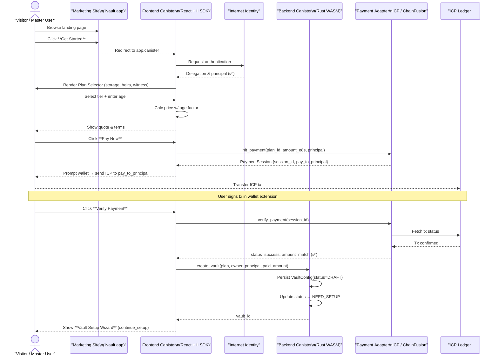
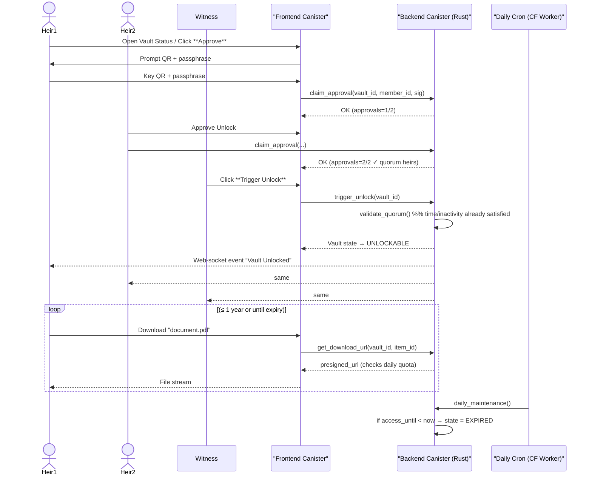
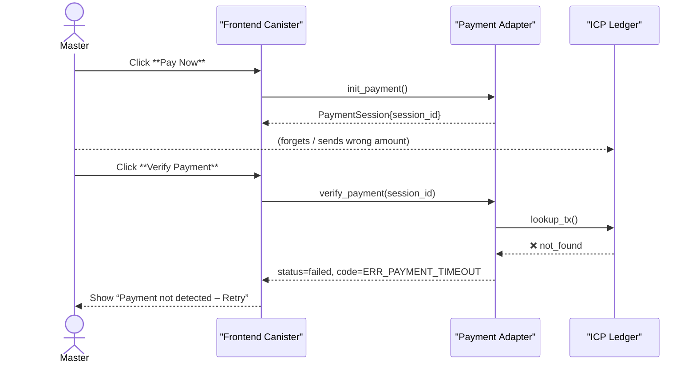
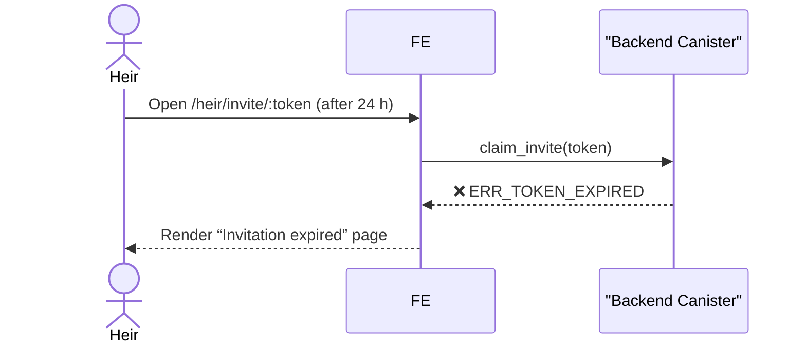
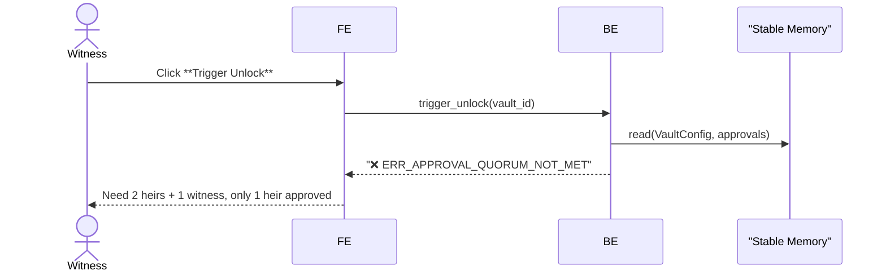
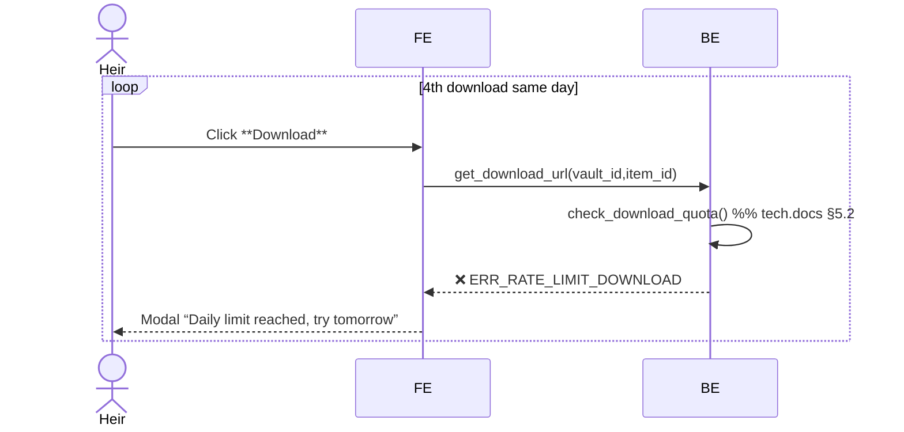
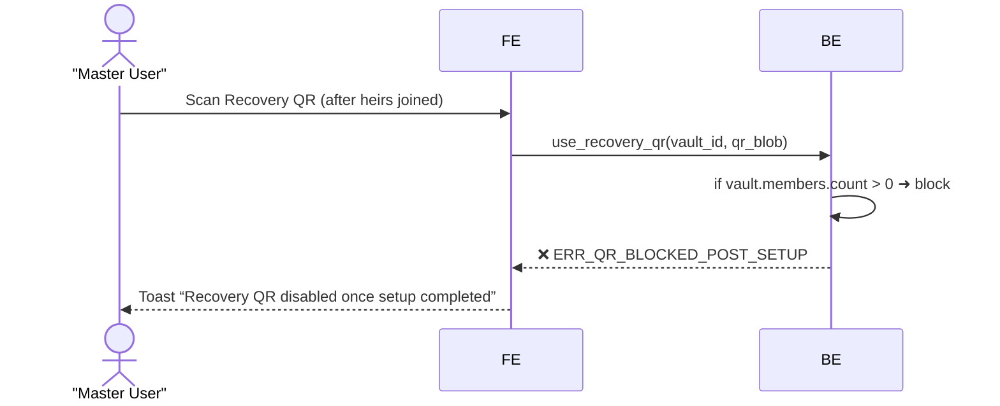

# 📌 LiVault User‑Journey Document

| Journey Stage | Master User | Heir | Witness | System / Admin |
|---------------|-------------|------|---------|----------------|
| Discover → Sign‑Up | Visits marketing site → clicks Get Started → authenticates with Internet Identity (II). | – | – | – |
| Plan Selection & Payment | Chooses storage tier & heirs/witness quota → quote is adjusted with age factor → pays 1‑time fee in ICP / ChainFusion. On success vault _id created (status=DRAFT → NEED_SETUP). ​prd | – | – | Billing ledger entry created; Admin can audit in Billing page. ​admin.wireframe |
| Vault Setup | Completes wizard: uploads encrypted content, sets unlock rules, invites heirs & optional witness (QR / link). status → ACTIVE when ≥1 heir claimed. ​prd | Receives invite link → logs‑in with II → sets passphrase → token claimed → gets Shamir key QR (offline backup). ​heir.wireframe | Same as heir but dashboard can Trigger Unlock instead of approve. ​witness.wireframe | Invite tokens stored (vault_invite_token); cron tracks expiry. |
| Active Period | Can add / update encrypted items, monitor approvals, revoke / regenerate invites. | Sees Vault Status card (pending unlock). May approve unlock after owner death/inactivity. | Monitors vaults; may Trigger Unlock once heirs have quorum or time condition met. | Off‑chain CF‑Worker heartbeat enforces expiry / grace‑period. ​tech.docs |
| Unlock Request | (None – deceased / inactive) | Clicks Approve Unlock → submits key QR + passphrase; approval count updates. ​heir.wireframe | Clicks Trigger Unlock → if approvals + time satisfied, vault UNLOCKABLE. ​witness.wireframe | Canister validates: time / inactivity + quorum + optional Recovery‑QR bypass. ​prd
| Post‑Unlock Access (≤ 1 year) | Read‑only; cannot alter content. | Views / downloads decrypted items (3 downloads / day guard). ​heir.wireframe | No content access by design. | Audit logs & daily quota counters updated; Admin sees metrics. ​tech.docs| 
| Expiry / Deletion | – | – | – | Scheduler moves UNLOCKABLE → EXPIRED → DELETED and purges storage; logs retained 365 d. ​prd |

## Pain‑Points & Opportunities
- Invite link friction: 24 h expiry may be short for non‑tech heirs → surface “Resend Invite” reminder banner.
- Unlock uncertainty: show live approval progress & ETA countdown on heir/witness dashboards to reduce anxiety.
- Post‑unlock quota: add “remaining download quota” badge plus scheduled email summary (future enhancement).
- Recovery‑QR misuse: highlight when QR becomes invalid once first heir/witness joins.

---

# Happy flow Sequence Diagram
## Discovery Sequence Diagram

**Key checkpoints**:
- Authentication success (II → FE)
- Payment session issued (`init_payment`)
- Ledger confirmation (`verify_payment`)
- VaultConfig persisted & state transitions `DRAFT` → `NEED_SETUP`
- User sees Continue Setup wizard with returned `vault_id`.

## Onboarding Sequence Diagram

```mermaid
sequenceDiagram
    %% Actors / Components
    actor Master as "Master User"
    actor Heir as "Heir (1 of N)"
    actor Witness as "Witness (Optional)"
    participant FE as "Frontend Canister\n(React UI)"
    participant BE as "Backend Canister\n(Rust)"
    participant Store as "Stable Memory"
    participant Cron as "Daily Cron (CF Worker)"

    %% --- 1. Continue Setup Wizard ---
    Master->>FE: Click **Continue Setup**
    FE->>Master: Wizard Step 1 (Vault Details)
    Master->>FE: Unlock rules, name, dates
    FE->>BE: update_vault(vault_id, details)
    BE->>Store: save(VaultConfig)
    FE->>Master: Wizard Step 2 (Upload Content)

    %% File upload (client‑encrypted)
    loop each file / letter / password
        Master->>FE: Choose item (encrypted)
        FE->>BE: begin_upload()
        FE->>BE: upload_chunk(idx, blob)
        FE->>BE: finish_upload()
        BE->>Store: save(VaultContentItem)
    end

    %% --- 2. Invite Witness (optional) ---
    Master->>FE: Add witness (name/email)
    FE->>BE: generate_invite(vault_id, role=witness)
    BE->>Store: save(VaultInviteToken)  %% schema :contentReference[oaicite:0]{index=0}&#8203;:contentReference[oaicite:1]{index=1}
    BE-->>FE: token+QR
    FE-->>Master: Show QR / copy link

    %% --- 3. Invite Heirs ---
    loop each heir (min 1)
        Master->>FE: Add heir (name/relation/email)
        FE->>BE: generate_invite(vault_id, role=heir)
        BE->>BE: allocate_shamir_index()  %% tech‑docs §2.2 :contentReference[oaicite:2]{index=2}&#8203;:contentReference[oaicite:3]{index=3}
        BE->>Store: save(invite_token)
        BE-->>FE: token+QR
        FE-->>Master: Display QR/link
    end

    %% --- 4. Heir / Witness Claim ---
    Heir->>FE: Open invite link
    FE->>Heir: Claim form (II login, passphrase)
    Heir->>FE: Submit passphrase
    FE->>BE: claim_invite(token, passphrase)
    BE->>Store: update token → claimed, create VaultMember (status=active) :contentReference[oaicite:4]{index=4}
    BE-->>FE: Shamir key QR
    FE-->>Heir: Show key (download / print)

    Witness->>FE: Similar claim flow (optional)
    FE->>BE: claim_invite(token)
    BE->>Store: create witness member

    %% --- 5. Finalize Setup ---
    Master->>FE: Click **Finish Setup**
    FE->>BE: finalize_setup(vault_id)
    BE->>BE: validate { ≥1 heir claimed, unlock_rules set }
    BE->>Store: set status = ACTIVE
    BE-->>FE: success

    FE-->>Master: Redirect to **Dashboard – Active Vault**

    %% --- 6. Active Period (Day‑to‑Day) ---
    alt Owner uploads new content
        Master->>FE: Upload encrypted item
        FE->>BE: upload_xxx()
        BE->>Store: append VaultContentItem
    end

    alt Heir requests status
        Heir->>FE: View Vault Status
        FE->>BE: get_vault(...)
        BE-->>FE: VaultConfig + approvals
        FE-->>Heir: Render status
    end

    Cron->>BE: daily_maintenance()
    BE->>BE: update expiry counters, send reminders

    Note over FE, BE: Vault remains **ACTIVE** until<br/>expiry or unlock‑condition met
```

**What this diagram covers**

| Step | Description & Key Schema |
|------|--------------------------|
| Wizard input → update_vault | Stores the vault’s name, unlock rules and expiry values (vault_config.schema). |
| Encrypted uploads | Each file/letter/password saved as a VaultContentItem (client‑side AES, server only sees ciphertext). |
| Invite generation | generate_invite returns a one‑time token (24 h) plus Shamir‑share index for heirs/witness. |
| Claim flow | claim_invite creates a VaultMember record with status=active and stores the passphrase flag. |
| Finalize Setup | Canister validates prerequisites and flips state NEED_SETUP → ACTIVE; the vault now counts down to expiry. |
| Active Period | Owner can keep adding content; heirs/witnesses can monitor status; off‑chain cron enforces lifecycle. |

## Core Unlock Sequence Diagram

**Notes**
- `validate_quorum()` checks 2 heirs + 1 witness or Recovery‑QR bypass.
- All user inputs are client‑encrypted; backend never sees plaintext data.
- Download quota logic lives in check_download_quota() (tech docs §5.2). ​

---
# Failure Path Sequence Diagram
## Payment Failure

**VaultConfig remains `DRAFT`; no `vault_id` is consumed.**

## Invite Token Expired (`ERR_TOKEN_EXPIRED`)

Schema reference: `vault_invite_token.status = expired` 

## Unlock Trigger Rejected – Quorum Not Met (`ERR_APPROVAL_QUORUM_NOT_MET`)

## Download Rate‑Limit Hit (`ERR_RATE_LIMIT_DOWNLOAD`)

## Recovery QR Blocked Post‑Setup (`ERR_QR_BLOCKED_POST_SETUP`)

| Error Code | Typical Cause | Mitigation UX |
|------------|--------------|--------------|
| ERR_UPLOAD_CHUNK_OUT_OF_ORDER | Network retry sent chunk #3 before #2 | FE retries auto in correct order |
| ERR_STORAGE_LIMIT | Upload exceeds plan MB quota | Offer Upgrade Plan CTA |
| ERR_NOT_AUTHORIZED | Caller principal ≠ vault owner / member | Redirect to login + context message |

*Last updated: 2025‑04‑19 by ChatGPT (o3) And Prasetyowira.*